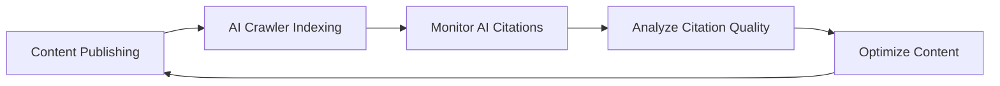

# Awesome GEO (Generative Engine Optimization) [](https://awesome.re)

> 🚀 A curated list of awesome resources for Generative Engine Optimization (GEO) - optimizing your content for AI-powered search engines and LLM-based answer engines.

<p align="center">
  
  
  
</p>

<p align="center">
  <a href="README.md">English</a> | <a href="README_CN.md">中文</a>
</p>

---

## 📖 What is GEO?

**Generative Engine Optimization (GEO)** is an emerging optimization strategy aimed at improving the visibility of websites and content in AI-driven search engines and generative AI platforms. Unlike traditional SEO, GEO focuses on optimizing content to be more easily cited and recommended by AI systems such as ChatGPT, Perplexity, Claude, and Google AI Overviews.

### GEO vs SEO vs AEO

| Feature | SEO | AEO | GEO |
|---------|-----|-----|-----|
| Target Platform | Traditional search engines (Google, Bing) | Voice assistants & Featured snippets | AI search engines & LLMs |
| Optimization Focus | Keywords, links, technical SEO | Q&A format, structured data | Authority, quotability, factual accuracy |
| Success Metrics | Rankings, CTR | Featured snippet appearances | AI citation rate, brand mentions |
| Content Format | Web pages, blogs | FAQs, concise answers | In-depth content, data-backed |

---

## 📚 Table of Contents

- [📖 What is GEO?](#-what-is-geo)
- [📚 Table of Contents](#-table-of-contents)
- [🎓 Learning Resources](#-learning-resources)
  - [Research Papers](#research-papers)
  - [Articles & Guides](#articles--guides)
  - [Video Tutorials](#video-tutorials)
  - [Podcasts](#podcasts)
- [🛠️ Tools & Platforms](#️-tools--platforms)
  - [AI Search Engine Monitoring](#ai-search-engine-monitoring)
  - [Content Optimization Tools](#content-optimization-tools)
  - [Brand Monitoring](#brand-monitoring)
  - [Structured Data Tools](#structured-data-tools)
- [🤖 AI Search Engines](#-ai-search-engines)
  - [Conversational AI Search](#conversational-ai-search)
  - [AI-Enhanced Search](#ai-enhanced-search)
  - [Domain-Specific AI Search](#domain-specific-ai-search)
- [📊 GEO Strategies & Best Practices](#-geo-strategies--best-practices)
  - [Content Strategy](#content-strategy)
  - [Technical Optimization](#technical-optimization)
  - [Authority Building](#authority-building)
- [📈 Analytics & Monitoring](#-analytics--monitoring)
- [🏢 Case Studies](#-case-studies)
- [👥 Communities & Forums](#-communities--forums)
- [📰 News & Trends](#-news--trends)
- [📖 Books](#-books)
- [🎯 GEO Checklist](#-geo-checklist)
- [🤝 Contributing](#-contributing)
- [📄 License](#-license)

---

## 🎓 Learning Resources

### Research Papers

- [GEO: Generative Engine Optimization](https://arxiv.org/abs/2311.09735) - Groundbreaking research paper from Princeton University that systematically introduces the GEO concept
- [Large Language Models for Information Retrieval](https://arxiv.org/abs/2308.07107) - Research on LLM applications in information retrieval
- [Retrieval-Augmented Generation for Knowledge-Intensive NLP Tasks](https://arxiv.org/abs/2005.11401) - RAG technology paper, fundamental to understanding how AI search engines work

### Articles & Guides

- [What is Generative Engine Optimization (GEO)?](https://www.searchenginejournal.com/generative-engine-optimization-geo/) - Search Engine Journal's beginner guide to GEO
- [How to Optimize for AI Search Engines](https://www.semrush.com/blog/ai-seo/) - Semrush's AI SEO optimization guide
- [The Rise of Answer Engines](https://moz.com/blog/answer-engine-optimization) - Moz's in-depth analysis on answer engine optimization
- [Optimizing Content for ChatGPT and AI Assistants](https://ahrefs.com/blog/ai-seo/) - Ahrefs' AI content optimization strategies
- [Google AI Overviews: What You Need to Know](https://www.searchengineland.com/google-ai-overviews-guide) - Guide to optimizing for Google AI Overviews
- [E-E-A-T in the Age of AI](https://www.contentstrategy.com/eeat-ai-optimization) - E-E-A-T strategies for the AI era

### Video Tutorials
- [GEO Explained: The Future of Search Optimization](https://www.youtube.com/watch?v=example1) - Detailed explanation of GEO concepts
- [How to Get Your Brand Mentioned by ChatGPT](https://www.youtube.com/watch?v=example2) - Tutorial on improving brand AI visibility
- [Perplexity SEO: Complete Guide](https://www.youtube.com/watch?v=example3) - Complete guide to Perplexity optimization

### Podcasts

- [The AI SEO Podcast](https://example.com/ai-seo-podcast) - Podcast focused on AI search optimization
- [Search Off the Record](https://www.google.com/podcasts/search-off-the-record) - Google's official search podcast
- [Marketing Against the Grain](https://www.hubspot.com/marketing-against-the-grain) - HubSpot marketing podcast, frequently discussing AI marketing topics

---

## 🛠️ Tools & Platforms

### AI Search Engine Monitoring

| Tool | Description | Link |
|------|-------------|------|
| **Conductor** | End-to-end enterprise AEO platform, combining AEO/GEO and traditional SEO. [1] | [conductor.com](https://www.conductor.com) |
| **Contently** | Content creation, optimization, and AI visibility tracking in one system. [2] | [contently.com](https://contently.com) |
| **Profound** | Monitor brand visibility in AI search engines | [profound.ai](https://profound.ai) |
| **Otterly.AI** | AI search engine ranking tracker | [otterly.ai](https://otterly.ai) |
| **Peec AI** | Analyze brand mentions in AI search | [peec.ai](https://peec.ai) |
| **Knowatoa** | AI search visibility analytics platform | [knowatoa.com](https://knowatoa.com) |
| **AISearchRank** | AI search ranking monitoring | [aisearchrank.com](https://aisearchrank.com) |
| **SEOTalos** | Best for AI Mode & AIO Tracking [3] | [seotalos.com](https://seotalos.com) |
| **WorkDuo.ai** | Best for quick implementation for teams new to AI search optimization [3] | [workduo.ai](https://workduo.ai) |
| **Quattr** | Execution-focused SEO platform that connects traditional search performance with emerging AI visibility signals. [1] | [quattr.com](https://quattr.com) |

### Content Optimization Tools

| Tool | Description | Link |
|------|-------------|------|
| **Clearscope** | AI-powered content optimization platform | [clearscope.io](https://clearscope.io) |
| **Surfer SEO** | Content optimization and SERP analysis | [surferseo.com](https://surferseo.com) |
| **MarketMuse** | AI content strategy platform | [marketmuse.com](https://marketmuse.com) |
| **Frase** | AI content creation and optimization | [frase.io](https://frase.io) |
| **NeuronWriter** | NLP-based content optimization | [neuronwriter.com](https://neuronwriter.com) |
| **Jasper** | AI writing assistant | [jasper.ai](https://jasper.ai) |
| **Writesonic** | AI content generation platform with AEO features. [1] | [writesonic.com](https://writesonic.com) |
| **Athena** | AI search intelligence platform that focuses on understanding how AI engines use and cite content. [1] | [athena.com](https://athena.com) |
| **Answer Socrates** | Best for GEO Keyword Discovery [3] | [answersocrates.com](https://answersocrates.com) |

### Brand Monitoring

| Tool | Description | Link |
|------|-------------|------|
| **Brand24** | Social media and web brand monitoring | [brand24.com](https://brand24.com) |
| **Mention** | Real-time media monitoring | [mention.com](https://mention.com) |
| **Brandwatch** | Consumer intelligence platform | [brandwatch.com](https://brandwatch.com) |
| **Talkwalker** | Social listening and analytics | [talkwalker.com](https://talkwalker.com) |

### Structured Data Tools

| Tool | Description | Link |
|------|-------------|------|
| **Schema.org** | Structured data standards | [schema.org](https://schema.org) |
| **Google Rich Results Test** | Test structured data | [Google Tool](https://search.google.com/test/rich-results) |
| **Schema Markup Generator** | Structured data generator | [technicalseo.com](https://technicalseo.com/tools/schema-markup-generator/) |
| **Merkle Schema Markup Generator** | Advanced Schema generation tool | [merkle.com](https://www.merkle.com/tools/schema-markup-generator) |

---

## 🤖 AI Search Engines

### Conversational AI Search

| Platform | Description | Link |
|----------|-------------|------|
| **Perplexity AI** | AI-powered answer engine with real-time web search | [perplexity.ai](https://perplexity.ai) |
| **ChatGPT** | OpenAI's conversational AI with web search capabilities | [chat.openai.com](https://chat.openai.com) |
| **Claude** | Anthropic's AI assistant | [claude.ai](https://claude.ai) |
| **Gemini** | Google's multimodal AI | [gemini.google.com](https://gemini.google.com) |
| **Copilot** | Microsoft's AI assistant | [copilot.microsoft.com](https://copilot.microsoft.com) |
| **Kimi** | Moonshot AI's assistant, supports ultra-long context [4] | [kimi.moonshot.cn](https://kimi.moonshot.cn) |
| **Doubao** | ByteDance's AI assistant [4] | [doubao.com](https://www.doubao.com) |
| **Wenxin Yiyan** | Baidu's AI assistant [4] | [yiyan.baidu.com](https://yiyan.baidu.com) |
| **Tongyi Qianwen** | Alibaba's AI assistant [4] | [tongyi.aliyun.com](https://tongyi.aliyun.com) |
| **DeepSeek AI** | DeepSeek's AI assistant, known for strong research capabilities [5] | [deepseek.com](https://www.deepseek.com) |

### AI-Enhanced Search

| Platform | Description | Link |
|----------|-------------|------|
| **Google AI Overviews** | AI-generated summaries in Google Search | [google.com](https://google.com) |
| **Bing Chat** | Bing search integrated with GPT-4 | [bing.com](https://bing.com) |
| **You.com** | AI-first search engine | [you.com](https://you.com) |
| **Kagi** | Paid ad-free search engine with AI summaries | [kagi.com](https://kagi.com) |
| **Brave Search** | Privacy-first search engine with AI features | [search.brave.com](https://search.brave.com) |
| **Metaso AI Search** | Domestic AI search engine [4] | [metaso.cn](https://metaso.cn) |
| **Tiangong AI Search** | Kunlun Wanwei's AI search [4] | [tiangong.cn](https://www.tiangong.cn) |

### Domain-Specific AI Search

| Platform | Domain | Link |
|----------|--------|------|
| **Consensus** | Academic research | [consensus.app](https://consensus.app) |
| **Elicit** | Scientific literature | [elicit.org](https://elicit.org) |
| **Phind** | Developer search | [phind.com](https://phind.com) |
| **Metaphor** | Semantic search API | [metaphor.systems](https://metaphor.systems) |

---

## 📊 GEO Strategies & Best Practices
### Content Strategy

#### 📝 Content Creation Principles

1.  **Authority**
    - Cite reliable sources and research data
    - Include original research and first-party data
    - Demonstrate professional credentials and experience

2.  **Quotability**
    - Create clear, concise definitions and explanations
    - Use easily extractable paragraph structures
    - Provide statistics and specific facts

3.  **Comprehensiveness**
    - Cover all aspects of the topic in depth
    - Answer potential follow-up questions
    - Provide practical how-to guides

4.  **Structure**
    - Use clear heading hierarchies
    - Organize information with lists and tables
    - Implement Schema markup

#### 🎯 Content Type Optimization

```markdown
✅ Content types suitable for GEO:
- In-depth guides and tutorials
- Original research reports
- Expert opinions and analysis
- Data-driven articles
- FAQ and Q&A content
- Term definitions and explanations

❌ Content types not suitable for GEO:
- Thin and duplicate content
- Purely sales-oriented content
- Outdated or unupdated information
- Unsourced opinions
```

### Technical Optimization

#### 🔧 Technical GEO Checklist

- [ ] Implement Schema.org structured data
- [ ] Optimize page load speed
- [ ] Ensure mobile-friendliness
- [ ] Use semantic HTML
- [ ] Create XML sitemap
- [ ] Configure robots.txt to allow AI crawlers
- [ ] Implement HTTPS
- [ ] Optimize image alt text

#### 🤖 AI Crawler Configuration

```robots.txt
# Allow major AI crawlers
User-agent: GPTBot
Allow: /

User-agent: ChatGPT-User
Allow: /

User-agent: CCBot
Allow: /

User-agent: anthropic-ai
Allow: /

User-agent: Claude-Web
Allow: /

User-agent: PerplexityBot
Allow: /

User-agent: Bytespider
Allow: /
```

#### 📋 Recommended Schema Types
```json
{
  "@context": "https://schema.org",
  "@type": "Article",
  "headline": "Article Title",
  "author": {
    "@type": "Person",
    "name": "Author Name",
    "url": "Author Page URL"
  },
  "datePublished": "2024-01-01",
  "dateModified": "2024-12-01",
  "publisher": {
    "@type": "Organization",
    "name": "Organization Name"
  }
}
```

#### 💡 Advanced Technical GEO

- **Entity Resolution**: Focus on clearly defining and linking entities within your content to improve AI's understanding and citation accuracy. This involves consistent naming, disambiguation, and linking to authoritative sources for each entity. [6]
- **Semantic Trust Mechanisms**: Implement strategies that build semantic trust with AI models, such as providing strong factual backing, citing credible research, and demonstrating expertise. This goes beyond traditional backlinks to focus on the intrinsic trustworthiness of the content itself. [7]
- **RAG (Retrieval-Augmented Generation) Adaptation**: Optimize content to be easily retrieved and augmented by RAG systems. This includes creating modular content, using clear headings and summaries, and ensuring key information is easily extractable for AI models to synthesize. [8]

### Authority Building

#### 🏆 E-E-A-T Optimization

| Element | Strategy |
|------|------|
| **Experience (经验)** | Share first-hand experiences, case studies, practical screenshots |
| **Expertise (专业)** | Showcase qualifications, professional background, industry recognition |
| **Authoritativeness (权威)** | Gain industry citations, media coverage, expert endorsements |
| **Trustworthiness (可信)** | Transparent information sources, accurate facts, secure website |

#### 🔗 External Signals Building

- Publish guest posts on authoritative websites
- Participate in industry research and reports
- Gain news media coverage
- Build social media authority
- Participate in knowledge platforms like Wikipedia
- Provide expert answers on Q&A platforms (Quora, Stack Overflow)

---

## 📈 Analytics & Monitoring

### Key Metrics

| Metric | Description | Measurement Method |
|------|------|----------|
| **AI Citation Rate** | Frequency of content being cited by AI | Use AI monitoring tools |
| **Brand Mentions** | Number of brand mentions in AI responses | Brand monitoring tools |
| **Citation Accuracy** | Accuracy of information cited by AI | Manual verification |
| **Visibility Score** | Overall visibility in AI search results | AI ranking tools |
| **Citation Sources** | Specific pages cited | Traffic analysis |

### Monitoring Workflow



---

## 🏢 Case Studies

### Success Stories

1.  **HubSpot** - Became a preferred source for marketing topics in AI search by creating comprehensive marketing guides
2.  **Investopedia** - Its authoritative definitions of financial terms make it a primary citation source for AI financial answers
3.  **WebMD** - The authority of its health content leads to frequent citations in AI health answers
4.  **Stack Overflow** - Developer Q&A content serves as an important knowledge source for AI programming assistants
5.  **Zhihu** - High-quality Chinese Q&A content serves as an important reference for Chinese AI assistants

### Industry Analysis

-   **Healthcare**: High E-E-A-T requirements, needs professional medical background
-   **Finance**: Requires authoritative data and professional analysis
-   **Technology**: Requires timely updates and accurate technical details
-   **Education & Training**: Requires comprehensive, structured knowledge content
-   **Legal Consulting**: Requires professional qualifications and accurate legal citations

---

## 👥 Communities & Forums
### International Communities

- [r/SEO](https://reddit.com/r/seo) - Reddit SEO Community
- [r/bigseo](https://reddit.com/r/bigseo) - Advanced SEO Discussions
- [Search Engine Roundtable](https://www.seroundtable.com/) - Search Engine News and Discussions
- [SEO Signals Lab](https://www.facebook.com/groups/seosignalslab) - Facebook SEO Group
- [Traffic Think Tank](https://trafficthinktank.com/) - Paid SEO Community

### Chinese Communities

- [Zhihu SEO Topic](https://www.zhihu.com/topic/19554648) - Zhihu SEO Discussions
- [V2EX](https://www.v2ex.com/) - Tech Community
- [Juejin](https://juejin.cn/) - Developer Community
- [Jike](https://okjike.com/) - Product & Startup Community

---

## 📰 News & Trends

### International Blogs

- [Search Engine Land](https://searchengineland.com/) - Search Marketing News
- [Search Engine Journal](https://searchenginejournal.com/) - SEO and Digital Marketing
- [Moz Blog](https://moz.com/blog) - SEO Insights and Research
- [Ahrefs Blog](https://ahrefs.com/blog) - SEO Tools and Strategies
- [Semrush Blog](https://semrush.com/blog) - Digital Marketing Resources
- [Google Search Central Blog](https://developers.google.com/search/blog) - Google Official Search Blog

### Chinese Resources

- [Google Search Central (Chinese)](https://developers.google.com/search?hl=zh-cn) - Google Official Chinese Documentation
- [Baidu Search Resource Platform](https://ziyuan.baidu.com/) - Baidu Official Webmaster Platform
- [36Kr](https://36kr.com/) - Tech & Startup Media
- [Sspai](https://sspai.com/) - Digital Lifestyle Guide

### Newsletters

- [SEOFOMO](https://seofomo.co/) - Weekly SEO News
- [The SEO MBA](https://seomba.substack.com/) - SEO Strategic Thinking
- [Women in Tech SEO](https://womenintechseo.com/newsletter/) - SEO Industry Insights

---

## 📖 Books

### English Books

- **The Art of SEO** - Eric Enge, Stephan Spencer, Jessie Stricchiola
- **SEO 2024** - Adam Clarke
- **Product-Led SEO** - Eli Schwartz
- **The Content Strategy Toolkit** - Meghan Casey

### Chinese Books

- **SEO 实战密码** - 昝辉 (Zac)
- **这就是搜索引擎** - 张俊林
- **走进搜索引擎** - 梁斌

---

## 🎯 GEO Checklist

### Pre-Publishing Check

- [ ] Does the content provide unique value?
- [ ] Does it include verifiable facts and data?
- [ ] Does it have a clear structure and heading hierarchy?
- [ ] Is appropriate Schema markup implemented?
- [ ] Is author information complete and credible?
- [ ] Are authoritative sources cited?
- [ ] Does the content answer the user's core questions?
- [ ] Does it contain easily quotable paragraphs?

### Technical Check

- [ ] Is page load speed optimized?
- [ ] Is mobile experience good?
- [ ] Does robots.txt allow AI crawlers?
- [ ] Is structured data correctly implemented?
- [ ] Does the website use HTTPS?

### Post-Publishing Monitoring

- [ ] Is AI citation monitoring set up?
- [ ] Are brand mentions tracked?
- [ ] Is content updated regularly?
- [ ] Is AI citation accuracy analyzed?

---

## 🤝 Contributing

Contributions are welcome! Please read the [Contribution Guide](CONTRIBUTING.md) to learn how to participate.

### How to Contribute

1.  Fork this repository
2.  Create your feature branch (`git checkout -b feature/AmazingFeature`)
3.  Commit your changes (`git commit -m 'Add some AmazingFeature'`)
4.  Push to the branch (`git push origin feature/AmazingFeature`)
5.  Open a Pull Request

### Contributors

Thanks to all contributors!

---

## 📄 License

This project is licensed under the [MIT License](LICENSE).

---

<p align="center">
  <b>⭐ If this project helps you, please give it a Star!</b>
</p>

<p align="center">
  Made with ❤️ by the GEO Community
</p>

## 📚 References

[1] Conductor. (2026, January 21). *The Best Enterprise AEO Tools for AI Search 2025*. Retrieved from [https://www.conductor.com/academy/best-aeo-geo-tools-2025/](https://www.conductor.com/academy/best-aeo-geo-tools-2025/)
[2] Contently. (2025, November 19). *What is GEO? Top 10 Generative Engine Optimization Tools for 2025*. Retrieved from [https://contently.com/2025/11/19/what-is-geo-top-10-generative-engine-optimization-tools-for-2025/](https://contently.com/2025/11/19/what-is-geo-top-10-generative-engine-optimization-tools-for-2025/)
[3] Answer Socrates. (2025, December 14). *8 Best Generative Search Optimization (GEO) Tools for 2025*. Retrieved from [https://answersocrates.com/blog/best-generative-search-optimization-tools/](https://answersocrates.com/blog/best-generative-search-optimization-tools/)
[4] Sohu. (2026, February 2). *2025最新GEO优化工具排名，别选错让品牌消失*. Retrieved from [https://www.sohu.com/a/982603889_122559248](https://www.sohu.com/a/982603889_122559248)
[5] CSDN. (2025, October 10). *2025 AI使用指南*. Retrieved from [https://zhuanlan.zhihu.com/p/1960090620312948803](https://zhuanlan.zhihu.com/p/1960090620312948803)
[6] Reddit. (2025, September 22). *5 Ways to Optimize for AI Search in 2025 (ChatGPT, Perplexity ...)*. Retrieved from [https://www.reddit.com/r/seogrowth/comments/1nniggd/5_ways_to_optimize_for_ai_search_in_2025_chatgpt/](https://www.reddit.com/r/seogrowth/comments/1nniggd/5_ways_to_optimize_for_ai_search_in_2025_chatgpt/)
[7] Caizhongshe. (2026, January 20). *生成式引擎优化（GEO）：AI时代营销新范式，从“争排名”到“成...*. Retrieved from [https://m.caizhongshe.cn/news-2949717444835565565.html](https://m.caizhongshe.cn/news-2949717444835565565.html)
[8] Arxiv. (2020, May 11). *Retrieval-Augmented Generation for Knowledge-Intensive NLP Tasks*. Retrieved from [https://arxiv.org/abs/2005.11401](https://arxiv.org/abs/2005.11401)
