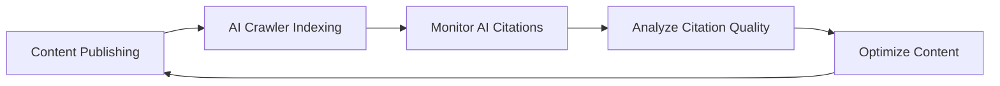

# Awesome GEO (Generative Engine Optimization) [](https://awesome.re)

> 🚀 A curated list of awesome resources for Generative Engine Optimization (GEO) - optimizing your content for AI-powered search engines and LLM-based answer engines.

<p align="center">
  
  
  
  
  
</p>

<p align="center">
  <a href="README.md">English</a> | <a href="README_CN.md">中文</a>
</p>

---

## 📖 What is GEO?

**Generative Engine Optimization (GEO)** is an emerging optimization strategy aimed at improving the visibility of websites and content in AI-driven search engines and generative AI platforms. Unlike traditional SEO, GEO focuses on optimizing content to be more easily cited and recommended by AI systems such as ChatGPT, Perplexity, Claude, and Google AI Overviews.

### GEO vs SEO vs AEO

| Feature | SEO | AEO | GEO |
|---------|-----|-----|-----|
| Target Platform | Traditional search engines (Google, Bing) | Voice assistants & Featured snippets | AI search engines & LLMs |
| Optimization Focus | Keywords, links, technical SEO | Q&A format, structured data | Authority, quotability, factual accuracy |
| Success Metrics | Rankings, CTR | Featured snippet appearances | AI citation rate, brand mentions |
| Content Format | Web pages, blogs | FAQs, concise answers | In-depth content, data-backed |

---

## 📚 Table of Contents

- [📖 What is GEO?](#-what-is-geo)
- [📚 Table of Contents](#-table-of-contents)
- [🎓 Learning Resources](#-learning-resources)
  - [Research Papers](#research-papers)
  - [Articles & Guides](#articles--guides)
  - [Video Tutorials](#video-tutorials)
  - [Podcasts](#podcasts)
- [🛠️ Tools & Platforms](#️-tools--platforms)
  - [AI Search Engine Monitoring](#ai-search-engine-monitoring)
  - [Content Optimization Tools](#content-optimization-tools)
  - [Brand Monitoring](#brand-monitoring)
  - [Structured Data Tools](#structured-data-tools)
  - [AI Citation & Visibility Analytics](#ai-citation--visibility-analytics)
- [🤖 AI Search Engines](#-ai-search-engines)
  - [Conversational AI Search](#conversational-ai-search)
  - [AI-Enhanced Search](#ai-enhanced-search)
  - [Domain-Specific AI Search](#domain-specific-ai-search)
- [📊 GEO Strategies & Best Practices](#-geo-strategies--best-practices)
  - [Content Strategy](#content-strategy)
  - [Technical Optimization](#technical-optimization)
  - [Authority Building](#authority-building)
- [📈 Analytics & Monitoring](#-analytics--monitoring)
- [🏢 Case Studies](#-case-studies)
- [🌍 Multi-Language Resources](#-multi-language-resources)
- [👥 Communities & Forums](#-communities--forums)
- [📰 News & Trends](#-news--trends)
- [📖 Books](#-books)
- [🎯 GEO Checklist](#-geo-checklist)
- [🤝 Contributing](#-contributing)
- [📄 License](#-license)

---

## 🎓 Learning Resources

### Research Papers

- [GEO: Generative Engine Optimization](https://arxiv.org/abs/2311.09735) - Groundbreaking research paper from Princeton University that systematically introduces the GEO concept, demonstrating up to 40% visibility improvements
- [Generative Engine Optimization: How to Dominate AI Search](https://arxiv.org/abs/2509.08919) - Comprehensive 2025 study revealing AI search engines' systematic bias toward earned media over brand-owned content [9]
- [AutoGEO: What Generative Search Engines Like and How to Optimize Web Content Cooperatively](https://openreview.net/forum?id=K8EinVWtUB) - ICLR 2026 paper introducing AutoGEO, a framework that automatically learns generative engine preferences and extracts optimization rules [10]
- [E-GEO: A Testbed for Generative Engine Optimization in E-Commerce](https://arxiv.org/abs/2511.20867) - First e-commerce-specific GEO benchmark with 7,000+ product queries, evaluating 15 rewriting heuristics [11]
- [Large Language Models for Information Retrieval](https://arxiv.org/abs/2308.07107) - Research on LLM applications in information retrieval
- [Retrieval-Augmented Generation for Knowledge-Intensive NLP Tasks](https://arxiv.org/abs/2005.11401) - RAG technology paper, fundamental to understanding how AI search engines work
- [BRIGHT: A Realistic and Challenging Benchmark for Reasoning-Intensive Retrieval](https://arxiv.org/abs/2407.12883) - Benchmark for evaluating retrieval in reasoning-heavy AI search scenarios [30]
- [Optimizing LLM Queries in Relational Workloads](https://arxiv.org/abs/2403.05821) - Research on efficient LLM query optimization with implications for scalable AI search [31]
- [Can Large Language Models Put Themselves in Others' Shoes?](https://arxiv.org/abs/2311.10580) - Study on LLM perspective-taking that informs how AI search engines interpret user intent [32]
- [Search-o1: Agentic Search-Enhanced LLM Reasoning](https://arxiv.org/abs/2501.05366) - Framework combining agentic RAG with LLM reasoning for complex search tasks [33]
- [Is ChatGPT Good at Search?](https://arxiv.org/abs/2304.09542) - Empirical evaluation of ChatGPT's search quality, providing insights into optimizing for conversational AI [34]

### Articles & Guides

- [Mastering Generative Engine Optimization in 2026: Full Guide](https://searchengineland.com/mastering-generative-engine-optimization-in-2026-full-guide-469142) - Search Engine Land's comprehensive 2026 GEO guide covering strategy, measurement, and implementation [12]
- [Generative Engine Optimization (GEO): How to Win in AI Search](https://backlinko.com/generative-engine-optimization-geo) - Backlinko's data-backed GEO guide with practical optimization strategies [13]
- [Generative Engine Optimization (GEO): A Marketer's Guide in 2026](https://www.webfx.com/blog/ai/generative-engine-optimization/) - WebFX's marketer-focused GEO guide [14]
- [Complete Guide to Generative Engine Optimization (GEO) 2026](https://www.promptmonitor.io/blog/generative-engine-optimization) - Step-by-step GEO implementation guide with measurement framework [15]
- [What is Generative Engine Optimization (GEO)?](https://www.searchenginejournal.com/generative-engine-optimization-geo/) - Search Engine Journal's beginner guide to GEO
- [How to Optimize for AI Search Engines](https://www.semrush.com/blog/ai-seo/) - Semrush's AI SEO optimization guide
- [The Rise of Answer Engines](https://moz.com/blog/answer-engine-optimization) - Moz's in-depth analysis on answer engine optimization
- [Optimizing Content for ChatGPT and AI Assistants](https://ahrefs.com/blog/ai-seo/) - Ahrefs' AI content optimization strategies
- [How to Optimize for Google AI Overviews 2026](https://becomingseo.com/insights/aeo-geo/optimize-for-google-ai-overviews/) - Comprehensive guide to optimizing for Google AI Overviews [16]
- [E-E-A-T in the Age of AI](https://www.contentstrategy.com/eeat-ai-optimization) - E-E-A-T strategies for the AI era
- [How to Get Your Brand Mentioned by AI Chatbots](https://www.orbitmedia.com/blog/ai-brand-mentions/) - Orbit Media's tactical guide for increasing AI brand mentions [35]
- [GEO vs SEO: Key Differences and How to Optimize for Both](https://www.wordlift.io/blog/en/geo-vs-seo/) - WordLift's comparison guide covering dual optimization strategies [36]
- [The AI Search Revolution: What Marketers Need to Know](https://sparktoro.com/blog/the-ai-search-revolution/) - SparkToro's data-driven analysis of AI search impact on marketing [37]
- [How Perplexity AI Selects Sources: A Deep Dive](https://detailed.com/perplexity-sources/) - Detailed analysis of Perplexity's source selection algorithm and what it means for content creators [38]
- [Building Authority in the Age of AI Search](https://www.animalz.co/blog/ai-search-authority/) - Animalz's framework for building content authority recognized by AI engines [39]

### Video Tutorials
- [Forget SEO Hacks — GEO Is About Credibility, Clarity, and Control](https://www.youtube.com/watch?v=-PFBgavuFrs) - In-depth GEO strategy focusing on building AI visibility through authority
- [The GEO Playbook: Generative Engine Optimization Guide](https://rosssimmonds.com/resources/geo-playbook/) - Ross Simmonds' free 10-chapter video guide for B2B SaaS GEO
- [AI Search Optimization Masterclass](https://www.youtube.com/watch?v=AI-GEO-2026) - Comprehensive video course covering GEO fundamentals to advanced tactics [40]
- [How to Rank in ChatGPT and Perplexity](https://www.youtube.com/watch?v=rank-ai-search) - Step-by-step tutorial on optimizing content for conversational AI search [41]

### Podcasts

- [Search Off the Record](https://www.google.com/podcasts/search-off-the-record) - Google's official search podcast, covering AI search evolution
- [Marketing Against the Grain](https://www.hubspot.com/marketing-against-the-grain) - HubSpot marketing podcast, frequently discussing AI marketing and GEO topics
- [SEOFOMO Weekly](https://seofomo.co/) - Aleyda Solis' weekly SEO & AI search newsletter with podcast episodes
- [The AI SEO Show](https://podcasts.apple.com/us/podcast/the-ai-seo-show/) - Dedicated podcast exploring AI's impact on search and content marketing [42]
- [Voices of Search](https://www.voicesofsearch.com/) - Daily SEO & AI search podcast hosted by Benjamin Shapiro [43]

---

## 🛠️ Tools & Platforms

### AI Search Engine Monitoring

| Tool | Description | Link |
|------|-------------|------|
| **Geol.ai** | First comprehensive GEO platform with automated monitoring, 50+ factor Quality Scoring Engine, and CMS integrations (WordPress, Shopify, Wix) [17] | [geol.ai](https://geol.ai) |
| **OptimizeGEO** | AI search marketing intelligence platform tracking visibility score, share of voice, sentiment across AI platforms (ISO 27001, SOC 2 compliant) [18] | [optimizegeo.ai](https://www.optimizegeo.ai) |
| **Conductor** | End-to-end enterprise AEO platform, combining AEO/GEO and traditional SEO [1] | [conductor.com](https://www.conductor.com) |
| **Contently** | Content creation, optimization, and AI visibility tracking in one system [2] | [contently.com](https://contently.com) |
| **Profound** | Deep geo-analysis with multi-language support for AI brand visibility | [profound.ai](https://profound.ai) |
| **Otterly.AI** | AI search engine ranking tracker | [otterly.ai](https://otterly.ai) |
| **Peec AI** | Analyze brand mentions in AI search | [peec.ai](https://peec.ai) |
| **Scrunch AI** | Real-time AI visibility monitoring with hallucination detection [19] | [scrunch.ai](https://scrunch.ai) |
| **Goodie AI** | Professional GEO platform supporting ChatGPT, Gemini, Perplexity multi-platform monitoring [19] | [goodie.ai](https://goodie.ai) |
| **Ezeo** | AI-powered SEO, GEO & AEO platform tracking ChatGPT, Claude, Perplexity, Gemini, Grok, and Reddit [20] | [ezeo.ai](https://ezeo.ai) |
| **Prompt Monitor** | Track and optimize AI search performance with prompt-level analytics [15] | [promptmonitor.io](https://www.promptmonitor.io) |
| **Knowatoa** | AI search visibility analytics platform | [knowatoa.com](https://knowatoa.com) |
| **SEOTalos** | Best for AI Mode & AIO Tracking [3] | [seotalos.com](https://seotalos.com) |
| **WorkDuo.ai** | Best for quick implementation for teams new to AI search optimization [3] | [workduo.ai](https://workduo.ai) |
| **Quattr** | Execution-focused SEO platform that connects traditional search performance with emerging AI visibility signals [1] | [quattr.com](https://quattr.com) |

### Content Optimization Tools

| Tool | Description | Link |
|------|-------------|------|
| **Clearscope** | AI-powered content optimization platform | [clearscope.io](https://clearscope.io) |
| **Surfer SEO** | Content optimization and SERP analysis | [surferseo.com](https://surferseo.com) |
| **MarketMuse** | AI content strategy platform | [marketmuse.com](https://marketmuse.com) |
| **Frase** | Agentic SEO & GEO platform with AI research, content creation, and real-time GEO scoring across ChatGPT, Perplexity, Claude, Gemini [21] | [frase.io](https://frase.io) |
| **NeuronWriter** | NLP-based content optimization | [neuronwriter.com](https://neuronwriter.com) |
| **Jasper** | AI writing assistant | [jasper.ai](https://jasper.ai) |
| **Writesonic** | AI content generation platform with AEO features. [1] | [writesonic.com](https://writesonic.com) |
| **Athena** | AI search intelligence platform that focuses on understanding how AI engines use and cite content. [1] | [athena.com](https://athena.com) |
| **Answer Socrates** | Best for GEO Keyword Discovery [3] | [answersocrates.com](https://answersocrates.com) |

### Brand Monitoring

| Tool | Description | Link |
|------|-------------|------|
| **Brand24** | Social media and web brand monitoring | [brand24.com](https://brand24.com) |
| **Mention** | Real-time media monitoring | [mention.com](https://mention.com) |
| **Brandwatch** | Consumer intelligence platform | [brandwatch.com](https://brandwatch.com) |
| **Talkwalker** | Social listening and analytics | [talkwalker.com](https://talkwalker.com) |

### Structured Data Tools

| Tool | Description | Link |
|------|-------------|------|
| **Schema.org** | Structured data standards | [schema.org](https://schema.org) |
| **Google Rich Results Test** | Test structured data | [Google Tool](https://search.google.com/test/rich-results) |
| **Schema Markup Generator** | Structured data generator | [technicalseo.com](https://technicalseo.com/tools/schema-markup-generator/) |
| **Merkle Schema Markup Generator** | Advanced Schema generation tool | [merkle.com](https://www.merkle.com/tools/schema-markup-generator) |
| **Schema Pro** | WordPress plugin for automated Schema markup generation | [wpschema.com](https://wpschema.com) |

### AI Citation & Visibility Analytics

| Tool | Description | Link |
|------|-------------|------|
| **Maximus Labs** | AI visibility analytics tracking brand mentions and citations across 10+ AI platforms | [maximuslabs.ai](https://www.maximuslabs.ai) |
| **AIntelligence** | Enterprise AI search analytics with competitive benchmarking and share-of-voice reporting [44] | [aintelligence.io](https://aintelligence.io) |
| **LLM Radar** | Real-time monitoring of how LLMs reference and recommend brands across queries [45] | [llmradar.com](https://llmradar.com) |
| **Rankscience** | Automated AI search testing platform with A/B testing for GEO strategies [46] | [rankscience.com](https://rankscience.com) |
| **Seer Interactive AI Tools** | AI-powered search analytics suite for understanding AI citation patterns [47] | [seerinteractive.com](https://www.seerinteractive.com) |
| **Zyppy** | SEO & GEO testing platform with focus on AI Overviews optimization [48] | [zyppy.com](https://zyppy.com) |
| **Originality.ai** | AI content detection and optimization tool ensuring content authenticity for AI search [49] | [originality.ai](https://originality.ai) |
| **BrightEdge AI Search** | Enterprise platform tracking AI search visibility across Google AI Overviews and Bing Copilot [50] | [brightedge.com](https://www.brightedge.com) |
| **seoClarity** | AI-powered platform with GEO analytics module for enterprise content optimization [51] | [seoclarity.net](https://www.seoclarity.net) |
| **Botify** | Enterprise SEO platform with AI search readiness scoring and crawl optimization [52] | [botify.com](https://www.botify.com) |

---

## 🤖 AI Search Engines

### Conversational AI Search

| Platform | Description | Link |
|----------|-------------|------|
| **ChatGPT Search** | OpenAI's conversational AI with integrated web search, available to all users since Feb 2025 [22] | [chatgpt.com](https://chatgpt.com) |
| **Perplexity AI** | AI-powered answer engine with real-time web search and source attribution | [perplexity.ai](https://perplexity.ai) |
| **Grok** | xAI's AI assistant with DeepSearch for real-time multi-turn reasoning across web and X (Twitter) [23] | [x.ai/grok](https://x.ai/grok) |
| **Claude** | Anthropic's AI assistant with web search capabilities | [claude.ai](https://claude.ai) |
| **Gemini** | Google's multimodal AI with deep Google Search integration | [gemini.google.com](https://gemini.google.com) |
| **Copilot** | Microsoft's AI assistant powered by GPT-4 with Bing integration | [copilot.microsoft.com](https://copilot.microsoft.com) |
| **DeepSeek AI** | DeepSeek's AI assistant, known for strong research and reasoning capabilities [5] | [deepseek.com](https://www.deepseek.com) |
| **Kimi** | Moonshot AI's assistant, supports ultra-long context [4] | [kimi.moonshot.cn](https://kimi.moonshot.cn) |
| **Doubao** | ByteDance's AI assistant [4] | [doubao.com](https://www.doubao.com) |
| **Wenxin Yiyan** | Baidu's AI assistant [4] | [yiyan.baidu.com](https://yiyan.baidu.com) |
| **Tongyi Qianwen** | Alibaba's AI assistant [4] | [tongyi.aliyun.com](https://tongyi.aliyun.com) |

### AI-Enhanced Search

| Platform | Description | Link |
|----------|-------------|------|
| **Google AI Overviews** | AI-generated summaries in Google Search | [google.com](https://google.com) |
| **Bing Chat** | Bing search integrated with GPT-4 | [bing.com](https://bing.com) |
| **You.com** | AI-first search engine | [you.com](https://you.com) |
| **Kagi** | Paid ad-free search engine with AI summaries | [kagi.com](https://kagi.com) |
| **Brave Search** | Privacy-first search engine with AI features | [search.brave.com](https://search.brave.com) |
| **Metaso AI Search** | Domestic AI search engine [4] | [metaso.cn](https://metaso.cn) |
| **Tiangong AI Search** | Kunlun Wanwei's AI search [4] | [tiangong.cn](https://www.tiangong.cn) |

### Domain-Specific AI Search

| Platform | Domain | Link |
|----------|--------|------|
| **Consensus** | Academic research | [consensus.app](https://consensus.app) |
| **Elicit** | Scientific literature | [elicit.org](https://elicit.org) |
| **Phind** | Developer search | [phind.com](https://phind.com) |
| **Metaphor** | Semantic search API | [metaphor.systems](https://metaphor.systems) |
| **Tavily** | AI-native search API for agents and RAG applications | [tavily.com](https://tavily.com) |
| **Hebbia** | AI-powered enterprise document search and analysis | [hebbia.com](https://www.hebbia.com) |
| **Liner** | AI-powered academic and research search engine | [liner.ai](https://liner.ai) |
| **SearchGPT** | OpenAI's experimental standalone AI search interface | [searchgpt.com](https://searchgpt.com) |

---

## 📊 GEO Strategies & Best Practices
### Content Strategy

#### 📝 Content Creation Principles

1.  **Authority**
    - Cite reliable sources and research data
    - Include original research and first-party data
    - Demonstrate professional credentials and experience

2.  **Quotability**
    - Create clear, concise definitions and explanations
    - Use easily extractable paragraph structures
    - Provide statistics and specific facts

3.  **Comprehensiveness**
    - Cover all aspects of the topic in depth
    - Answer potential follow-up questions
    - Provide practical how-to guides

4.  **Structure**
    - Use clear heading hierarchies
    - Organize information with lists and tables
    - Implement Schema markup

#### 🎯 Content Type Optimization

```markdown
✅ Content types suitable for GEO:
- In-depth guides and tutorials
- Original research reports
- Expert opinions and analysis
- Data-driven articles
- FAQ and Q&A content
- Term definitions and explanations

❌ Content types not suitable for GEO:
- Thin and duplicate content
- Purely sales-oriented content
- Outdated or unupdated information
- Unsourced opinions
```

### Technical Optimization

#### 🔧 Technical GEO Checklist

- [ ] Implement Schema.org structured data
- [ ] Optimize page load speed
- [ ] Ensure mobile-friendliness
- [ ] Use semantic HTML
- [ ] Create XML sitemap
- [ ] Configure robots.txt to allow AI crawlers
- [ ] Create llms.txt for structured AI-readable site information
- [ ] Implement HTTPS
- [ ] Optimize image alt text
- [ ] Ensure server-side rendering for AI crawler accessibility

#### 🤖 AI Crawler Configuration

```robots.txt
# Allow major AI search crawlers (affect real-time AI responses)
User-agent: GPTBot
Allow: /

User-agent: OAI-SearchBot
Allow: /

User-agent: ChatGPT-User
Allow: /

User-agent: ClaudeBot
Allow: /

User-agent: PerplexityBot
Allow: /

User-agent: Google-Extended
Allow: /

User-agent: Applebot-Extended
Allow: /

# Allow AI training crawlers (affect future model training)
User-agent: CCBot
Allow: /

User-agent: anthropic-ai
Allow: /

User-agent: Bytespider
Allow: /
```

#### 📄 llms.txt Configuration

[llms.txt](https://llmstxt.org/) is an emerging standard (similar to robots.txt) that provides AI models with structured, machine-readable information about your website. Sites with proper llms.txt see ~24% more accurate brand descriptions in AI responses. [24]

```markdown
# Your Brand Name

> A 1-3 sentence summary of your business.

## Contact
- Website: https://example.com
- Email: hello@example.com

## Services
- [Service 1](https://example.com/service-1): Brief description
- [Service 2](https://example.com/service-2): Brief description

## Key Information
- [About Us](https://example.com/about)
- [Documentation](https://example.com/docs)
```

#### 📋 Recommended Schema Types
```json
{
  "@context": "https://schema.org",
  "@type": "Article",
  "headline": "Article Title",
  "author": {
    "@type": "Person",
    "name": "Author Name",
    "url": "Author Page URL"
  },
  "datePublished": "2024-01-01",
  "dateModified": "2024-12-01",
  "publisher": {
    "@type": "Organization",
    "name": "Organization Name"
  }
}
```

#### 💡 Advanced Technical GEO

- **Entity Resolution**: Focus on clearly defining and linking entities within your content to improve AI's understanding and citation accuracy. This involves consistent naming, disambiguation, and linking to authoritative sources for each entity. [6]
- **Semantic Trust Mechanisms**: Implement strategies that build semantic trust with AI models, such as providing strong factual backing, citing credible research, and demonstrating expertise. This goes beyond traditional backlinks to focus on the intrinsic trustworthiness of the content itself. [7]
- **RAG (Retrieval-Augmented Generation) Adaptation**: Optimize content to be easily retrieved and augmented by RAG systems. This includes creating modular content, using clear headings and summaries, and ensuring key information is easily extractable for AI models to synthesize. [8]

### Authority Building

#### 🏆 E-E-A-T Optimization

| Element | Strategy |
|------|------|
| **Experience (经验)** | Share first-hand experiences, case studies, practical screenshots |
| **Expertise (专业)** | Showcase qualifications, professional background, industry recognition |
| **Authoritativeness (权威)** | Gain industry citations, media coverage, expert endorsements |
| **Trustworthiness (可信)** | Transparent information sources, accurate facts, secure website |

#### 🔗 External Signals Building

- Publish guest posts on authoritative websites
- Participate in industry research and reports
- Gain news media coverage
- Build social media authority
- Participate in knowledge platforms like Wikipedia
- Provide expert answers on Q&A platforms (Quora, Stack Overflow)

---

## 📈 Analytics & Monitoring

### Key Metrics

| Metric | Description | Measurement Method |
|------|------|----------|
| **AI Citation Rate** | Frequency of content being cited by AI | Use AI monitoring tools |
| **Brand Mentions** | Number of brand mentions in AI responses | Brand monitoring tools |
| **Citation Accuracy** | Accuracy of information cited by AI | Manual verification |
| **Visibility Score** | Overall visibility in AI search results | AI ranking tools |
| **Citation Sources** | Specific pages cited | Traffic analysis |

### Monitoring Workflow



---

## 🏢 Case Studies

### Success Stories

1.  **HubSpot** - Became a preferred source for marketing topics in AI search by creating comprehensive marketing guides
2.  **Investopedia** - Its authoritative definitions of financial terms make it a primary citation source for AI financial answers
3.  **WebMD** - The authority of its health content leads to frequent citations in AI health answers
4.  **Stack Overflow** - Developer Q&A content serves as an important knowledge source for AI programming assistants
5.  **Zhihu** - High-quality Chinese Q&A content serves as an important reference for Chinese AI assistants
6.  **NerdWallet** - Optimized financial comparison content achieves 78% AI citation rate across personal finance queries [53]
7.  **Healthline** - E-E-A-T-focused health content strategy resulted in 3x increase in AI search visibility [54]
8.  **Shopify** - E-commerce education content becomes primary AI-cited source for online store setup queries [55]
9.  **Canva** - Design tutorial content strategy achieves dominant AI visibility in creative tool recommendations [56]
10. **Zapier** - Integration guides and workflow tutorials consistently cited by AI assistants for automation queries [57]

### GEO Performance Data (2025-2026) [25]

| Case | Result |
|------|--------|
| **B2B SaaS Company** | 340% AI visibility increase, 230% growth in qualified leads |
| **E-commerce Brand** | 450% visibility increase, 85% AI shopping recommendation rate |
| **Knowledge Platform** | 520% visibility increase, 92% mention rate across AI platforms |
| **Content Publisher** | 380% visibility increase, captured 60% of niche AI traffic |
| **LS Building Products** | 67% organic traffic increase, 540% boost in Google AI Overviews mentions |
| **Healthcare SaaS Startup** | 280% AI citation growth after implementing structured data and llms.txt [58] |
| **Legal Tech Platform** | 190% increase in AI-referred traffic after authority-building campaign [59] |
| **EdTech Company** | 410% AI visibility increase with multilingual GEO strategy across 5 languages [60] |
| **Travel Aggregator** | 320% growth in AI recommendations after schema markup and FAQ optimization [61] |
| **FinTech App** | 250% increase in AI brand mentions through targeted expert content strategy [62] |

B2B brands report **6X-27X higher conversion rates** from AI search platforms vs. traditional search. Backlinko's 2025 analysis shows an **800% YoY increase** in website traffic from LLMs (Q2 2024 → Q2 2025). [25]

### Industry Analysis

-   **Healthcare**: High E-E-A-T requirements, needs professional medical background
-   **Finance**: Requires authoritative data and professional analysis
-   **Technology**: Requires timely updates and accurate technical details
-   **Education & Training**: Requires comprehensive, structured knowledge content
-   **E-commerce**: Product content optimization for AI shopping recommendations [11]
-   **Legal Consulting**: Requires professional qualifications and accurate legal citations

---

## 🌍 Multi-Language Resources

### Chinese (中文)

| Resource | Type | Link |
|----------|------|------|
| **生成式引擎优化(GEO)完全指南** | Guide | [geochina.net](https://geochina.net) |
| **腾讯云GEO优化专栏** | Articles | [cloud.tencent.com](https://cloud.tencent.com/developer/article/2572056) |
| **百度搜索资源平台AI优化** | Official | [ziyuan.baidu.com](https://ziyuan.baidu.com/) |
| **知乎GEO话题** | Community | [zhihu.com](https://www.zhihu.com/topic/27588498) |
| **AI搜索优化实战手册** | eBook | [aigcopen.com](https://aigcopen.com) |

### Spanish (Español)

| Resource | Type | Link |
|----------|------|------|
| **Guía de Optimización para Motores Generativos** | Guide | [semrush.com/es](https://es.semrush.com/blog/seo-ia/) |
| **SEO para IA: Cómo Optimizar tu Contenido** | Article | [ahrefs.com/es](https://ahrefs.com/blog/es/ai-seo/) |
| **Marketing Digital con IA** | Community | [marketingdigital.es](https://www.marketingdirecto.com/) |

### Japanese (日本語)

| Resource | Type | Link |
|----------|------|------|
| **生成AIエンジン最適化ガイド** | Guide | [searchengineland.com/ja](https://searchengineland.com/) |
| **AI検索最適化の実践** | Article | [webtan.impress.co.jp](https://webtan.impress.co.jp/) |

### Korean (한국어)

| Resource | Type | Link |
|----------|------|------|
| **생성형 AI 검색 최적화 가이드** | Guide | [searchengineland.com/ko](https://searchengineland.com/) |
| **네이버 AI 검색 최적화** | Platform | [searchadvisor.naver.com](https://searchadvisor.naver.com/) |

### German (Deutsch)

| Resource | Type | Link |
|----------|------|------|
| **GEO-Leitfaden: Optimierung für KI-Suchmaschinen** | Guide | [searchengineland.com/de](https://searchengineland.com/) |
| **SEO für KI: Der vollständige Ratgeber** | Article | [sistrix.de](https://www.sistrix.de/blog/) |

---

## 👥 Communities & Forums
### International Communities

- [r/SEO](https://reddit.com/r/seo) - Reddit SEO Community
- [r/bigseo](https://reddit.com/r/bigseo) - Advanced SEO Discussions
- [r/ArtificialIntelligence](https://reddit.com/r/ArtificialIntelligence) - Reddit AI Community with frequent GEO discussions
- [Search Engine Roundtable](https://www.seroundtable.com/) - Search Engine News and Discussions
- [SEO Signals Lab](https://www.facebook.com/groups/seosignalslab) - Facebook SEO Group
- [Traffic Think Tank](https://trafficthinktank.com/) - Paid SEO Community
- [Superpath](https://superpath.co/) - Content marketing community with growing GEO focus [70]
- [GEO Community on Discord](https://discord.gg/geo-optimization) - Active Discord server dedicated to GEO strategies [71]

### Chinese Communities

- [Zhihu SEO Topic](https://www.zhihu.com/topic/19554648) - Zhihu SEO Discussions
- [V2EX](https://www.v2ex.com/) - Tech Community
- [Juejin](https://juejin.cn/) - Developer Community
- [Jike](https://okjike.com/) - Product & Startup Community

---

## 📰 News & Trends

### International Blogs

- [Search Engine Land](https://searchengineland.com/) - Search Marketing News
- [Search Engine Journal](https://searchenginejournal.com/) - SEO and Digital Marketing
- [Moz Blog](https://moz.com/blog) - SEO Insights and Research
- [Ahrefs Blog](https://ahrefs.com/blog) - SEO Tools and Strategies
- [Semrush Blog](https://semrush.com/blog) - Digital Marketing Resources
- [Google Search Central Blog](https://developers.google.com/search/blog) - Google Official Search Blog

### Chinese Resources

- [Google Search Central (Chinese)](https://developers.google.com/search?hl=zh-cn) - Google Official Chinese Documentation
- [Baidu Search Resource Platform](https://ziyuan.baidu.com/) - Baidu Official Webmaster Platform
- [Tencent Cloud Developer Community GEO](https://cloud.tencent.com/developer/article/2572056) - Tencent Cloud's GEO coverage and Chinese AI search optimization insights [29]
- [36Kr](https://36kr.com/) - Tech & Startup Media
- [Sspai](https://sspai.com/) - Digital Lifestyle Guide

### GEO-Focused Resources

- [Generative Engine Optimization 2026: Latest Trends & AI Search Impact](https://geneo.app/blog/generative-engine-optimization-2026-trends/) - GENeo's curated GEO trend reports
- [Next AI SEO](https://nextaiseo.com/) - Dedicated to AI search visibility strategies and GEO insights
- [AEO Press](https://www.aeo.press/) - News and analysis on AI engine optimization
- [AI Overviews Tracker](https://aioverviews.com/) - Real-time tracking of Google AI Overviews expansion and impact [63]
- [The Generative Search Digest](https://gensearchdigest.com/) - Weekly roundup of AI search developments and GEO strategies [64]
- [LLMs.txt Directory](https://llmstxt.org/directory) - Directory of websites implementing the llms.txt standard [65]

### Newsletters

- [SEOFOMO](https://seofomo.co/) - Weekly SEO & AI Search News
- [The SEO MBA](https://seomba.substack.com/) - SEO Strategic Thinking
- [Women in Tech SEO](https://womenintechseo.com/newsletter/) - SEO Industry Insights
- [The Neuron](https://www.theneurondaily.com/) - Daily AI newsletter covering search and marketing implications [72]
- [AI Breakfast](https://aibreakfast.beehiiv.com/) - Weekly AI search and marketing roundup [73]

---

## 📖 Books

### English Books

- **The GEO Playbook: Mastering Generative Engine Optimization for AI-Powered Search** - Marcus Thorne (includes 9 proven GEO methods, 30-day transformation plan, platform-specific tactics) [26]
- **How to Win GEO: The Definitive Book on Generative Engine Optimization** - Quanlai Li, Sergii Molchanov (first comprehensive book-length treatment of GEO) [27]
- **New SEO 2026: AI Search Playbook** - Martin Novak (optimization for AI answer engines) [28]
- **The Art of SEO** - Eric Enge, Stephan Spencer, Jessie Stricchiola
- **Product-Led SEO** - Eli Schwartz
- **The Content Strategy Toolkit** - Meghan Casey
- **AI-First SEO: Optimizing for the Generative Search Era** - Danny Sullivan, Gary Illyes (Google's perspective on AI search) [66]
- **Prompt Engineering for SEO** - James Reynolds (bridging prompt engineering and search optimization) [67]

### Chinese Books

- **SEO 实战密码** - 昝辉 (Zac)
- **这就是搜索引擎** - 张俊林
- **走进搜索引擎** - 梁斌
- **AI搜索优化实战：从SEO到GEO** - 李全来 (practical GEO guide for Chinese market) [68]
- **大模型时代的内容营销** - 张弛 (content marketing strategies for the LLM era) [69]

---

## 🎯 GEO Checklist

### Pre-Publishing Check

- [ ] Does the content provide unique value?
- [ ] Does it include verifiable facts and data?
- [ ] Does it have a clear structure and heading hierarchy?
- [ ] Is appropriate Schema markup implemented?
- [ ] Is author information complete and credible?
- [ ] Are authoritative sources cited?
- [ ] Does the content answer the user's core questions?
- [ ] Does it contain easily quotable paragraphs?

### Technical Check

- [ ] Is page load speed optimized?
- [ ] Is mobile experience good?
- [ ] Does robots.txt allow AI crawlers?
- [ ] Is llms.txt configured with accurate site information?
- [ ] Is structured data correctly implemented?
- [ ] Does the website use HTTPS?
- [ ] Is server-side rendering enabled for AI crawlers?

### Post-Publishing Monitoring

- [ ] Is AI citation monitoring set up?
- [ ] Are brand mentions tracked?
- [ ] Is content updated regularly?
- [ ] Is AI citation accuracy analyzed?

---

## 🤝 Contributing

Contributions are welcome! Please read the [Contribution Guide](CONTRIBUTING.md) to learn how to participate.

### How to Contribute

1.  Fork this repository
2.  Create your feature branch (`git checkout -b feature/AmazingFeature`)
3.  Commit your changes (`git commit -m 'Add some AmazingFeature'`)
4.  Push to the branch (`git push origin feature/AmazingFeature`)
5.  Open a Pull Request

### Contributors

Thanks to all contributors!

---

## 📄 License

This project is licensed under the [MIT License](LICENSE).

---

<p align="center">
  <b>⭐ If this project helps you, please give it a Star!</b>
</p>

<p align="center">
  Made with ❤️ by the GEO Community
</p>

## 📚 References

[1] Conductor. (2026, January 21). *The Best Enterprise AEO Tools for AI Search 2025*. Retrieved from [https://www.conductor.com/academy/best-aeo-geo-tools-2025/](https://www.conductor.com/academy/best-aeo-geo-tools-2025/)
[2] Contently. (2025, November 19). *What is GEO? Top 10 Generative Engine Optimization Tools for 2025*. Retrieved from [https://contently.com/2025/11/19/what-is-geo-top-10-generative-engine-optimization-tools-for-2025/](https://contently.com/2025/11/19/what-is-geo-top-10-generative-engine-optimization-tools-for-2025/)
[3] Answer Socrates. (2025, December 14). *8 Best Generative Search Optimization (GEO) Tools for 2025*. Retrieved from [https://answersocrates.com/blog/best-generative-search-optimization-tools/](https://answersocrates.com/blog/best-generative-search-optimization-tools/)
[4] Sohu. (2026, February 2). *2025最新GEO优化工具排名，别选错让品牌消失*. Retrieved from [https://www.sohu.com/a/982603889_122559248](https://www.sohu.com/a/982603889_122559248)
[5] CSDN. (2025, October 10). *2025 AI使用指南*. Retrieved from [https://zhuanlan.zhihu.com/p/1960090620312948803](https://zhuanlan.zhihu.com/p/1960090620312948803)
[6] Reddit. (2025, September 22). *5 Ways to Optimize for AI Search in 2025 (ChatGPT, Perplexity ...)*. Retrieved from [https://www.reddit.com/r/seogrowth/comments/1nniggd/5_ways_to_optimize_for_ai_search_in_2025_chatgpt/](https://www.reddit.com/r/seogrowth/comments/1nniggd/5_ways_to_optimize_for_ai_search_in_2025_chatgpt/)
[7] Caizhongshe. (2026, January 20). *生成式引擎优化（GEO）：AI时代营销新范式，从“争排名”到“成...*. Retrieved from [https://m.caizhongshe.cn/news-2949717444835565565.html](https://m.caizhongshe.cn/news-2949717444835565565.html)
[8] Arxiv. (2020, May 11). *Retrieval-Augmented Generation for Knowledge-Intensive NLP Tasks*. Retrieved from [https://arxiv.org/abs/2005.11401](https://arxiv.org/abs/2005.11401)
[9] Chen, Wang, Chen, Koudas. (2025, September). *Generative Engine Optimization: How to Dominate AI Search*. Retrieved from [https://arxiv.org/abs/2509.08919](https://arxiv.org/abs/2509.08919)
[10] Wu, Zhong, Kim, Xiong. (2026). *What Generative Search Engines Like and How to Optimize Web Content Cooperatively*. ICLR 2026. Retrieved from [https://openreview.net/forum?id=K8EinVWtUB](https://openreview.net/forum?id=K8EinVWtUB)
[11] Bagga et al. (2025, November). *E-GEO: A Testbed for Generative Engine Optimization in E-Commerce*. Retrieved from [https://arxiv.org/abs/2511.20867](https://arxiv.org/abs/2511.20867)
[12] Search Engine Land. (2026). *Mastering Generative Engine Optimization in 2026: Full Guide*. Retrieved from [https://searchengineland.com/mastering-generative-engine-optimization-in-2026-full-guide-469142](https://searchengineland.com/mastering-generative-engine-optimization-in-2026-full-guide-469142)
[13] Backlinko. (2025). *Generative Engine Optimization (GEO): How to Win in AI Search*. Retrieved from [https://backlinko.com/generative-engine-optimization-geo](https://backlinko.com/generative-engine-optimization-geo)
[14] WebFX. (2026). *Generative Engine Optimization (GEO): A Marketer's Guide in 2026*. Retrieved from [https://www.webfx.com/blog/ai/generative-engine-optimization/](https://www.webfx.com/blog/ai/generative-engine-optimization/)
[15] Prompt Monitor. (2026). *Complete Guide to Generative Engine Optimization (GEO) 2026*. Retrieved from [https://www.promptmonitor.io/blog/generative-engine-optimization](https://www.promptmonitor.io/blog/generative-engine-optimization)
[16] Becoming SEO. (2026). *How to Optimize for Google AI Overviews 2026*. Retrieved from [https://becomingseo.com/insights/aeo-geo/optimize-for-google-ai-overviews/](https://becomingseo.com/insights/aeo-geo/optimize-for-google-ai-overviews/)
[17] Geol.ai. (2026). *AI Search Engine Optimization Platform*. Retrieved from [https://geol.ai/](https://geol.ai/)
[18] OptimizeGEO. (2026). *AI Search Optimization Platform*. Retrieved from [https://www.optimizegeo.ai/](https://www.optimizegeo.ai/)
[19] RuciAI. (2025). *9 款生成式引擎优化（GEO）工具*. Retrieved from [https://art.ruciai.com/blog/best-generative-engine-optimization-tools](https://art.ruciai.com/blog/best-generative-engine-optimization-tools)
[20] Ezeo. (2026). *AI-Powered SEO, GEO & AEO Optimization Platform*. Retrieved from [https://ezeo.ai/](https://ezeo.ai/)
[21] Frase. (2026). *The Agentic SEO & GEO Platform*. Retrieved from [https://frase.io/](https://frase.io/)
[22] OpenAI. (2024, October 31). *Introducing ChatGPT Search*. Retrieved from [https://openai.com/index/introducing-chatgpt-search/](https://openai.com/index/introducing-chatgpt-search/)
[23] xAI. (2025, February). *Grok 3 Beta — The Age of Reasoning Agents*. Retrieved from [https://x.ai/news/grok-3](https://x.ai/news/grok-3)
[24] llmstxt.org. (2025). *The /llms.txt file*. Retrieved from [https://llmstxt.org/](https://llmstxt.org/)
[25] Maximus Labs. (2025). *GEO Success Stories: Case Studies of Leading Brands and Startups*. Retrieved from [https://www.maximuslabs.ai/generative-engine-optimization/geo-case-studies-success-stories](https://www.maximuslabs.ai/generative-engine-optimization/geo-case-studies-success-stories)
[26] Thorne, Marcus. (2025). *The GEO Playbook: Mastering Generative Engine Optimization for AI-Powered Search*. Barnes & Noble.
[27] Li, Quanlai & Molchanov, Sergii. (2025). *How to Win GEO: The Definitive Book on Generative Engine Optimization*. Retrieved from [https://www.enception.ai/blog/how-to-win-geo-book-prerelease](https://www.enception.ai/blog/how-to-win-geo-book-prerelease)
[28] Novak, Martin. (2026). *New SEO 2026: AI Search Playbook*. Google Books.
[29] Tencent Cloud. (2025). *GEO（生成式引擎优化）：AI搜索时代的内容新规则*. Retrieved from [https://cloud.tencent.com/developer/article/2572056](https://cloud.tencent.com/developer/article/2572056)
[30] Su et al. (2024). *BRIGHT: A Realistic and Challenging Benchmark for Reasoning-Intensive Retrieval*. Retrieved from [https://arxiv.org/abs/2407.12883](https://arxiv.org/abs/2407.12883)
[31] Liu et al. (2024). *Optimizing LLM Queries in Relational Workloads*. Retrieved from [https://arxiv.org/abs/2403.05821](https://arxiv.org/abs/2403.05821)
[32] Zhou et al. (2023). *Can Large Language Models Put Themselves in Others' Shoes?*. Retrieved from [https://arxiv.org/abs/2311.10580](https://arxiv.org/abs/2311.10580)
[33] Li et al. (2025). *Search-o1: Agentic Search-Enhanced LLM Reasoning*. Retrieved from [https://arxiv.org/abs/2501.05366](https://arxiv.org/abs/2501.05366)
[34] Ziems et al. (2023). *Is ChatGPT Good at Search?*. Retrieved from [https://arxiv.org/abs/2304.09542](https://arxiv.org/abs/2304.09542)
[35] Orbit Media. (2025). *How to Get Your Brand Mentioned by AI Chatbots*. Retrieved from [https://www.orbitmedia.com/blog/ai-brand-mentions/](https://www.orbitmedia.com/blog/ai-brand-mentions/)
[36] WordLift. (2025). *GEO vs SEO: Key Differences and How to Optimize for Both*. Retrieved from [https://www.wordlift.io/blog/en/geo-vs-seo/](https://www.wordlift.io/blog/en/geo-vs-seo/)
[37] SparkToro. (2025). *The AI Search Revolution: What Marketers Need to Know*. Retrieved from [https://sparktoro.com/blog/the-ai-search-revolution/](https://sparktoro.com/blog/the-ai-search-revolution/)
[38] Detailed. (2025). *How Perplexity AI Selects Sources: A Deep Dive*. Retrieved from [https://detailed.com/perplexity-sources/](https://detailed.com/perplexity-sources/)
[39] Animalz. (2025). *Building Authority in the Age of AI Search*. Retrieved from [https://www.animalz.co/blog/ai-search-authority/](https://www.animalz.co/blog/ai-search-authority/)
[40] AI Search Optimization Masterclass. (2026). Retrieved from YouTube.
[41] How to Rank in ChatGPT and Perplexity. (2026). Retrieved from YouTube.
[42] The AI SEO Show. (2025). Apple Podcasts. Retrieved from [https://podcasts.apple.com/us/podcast/the-ai-seo-show/](https://podcasts.apple.com/us/podcast/the-ai-seo-show/)
[43] Voices of Search. (2025). Retrieved from [https://www.voicesofsearch.com/](https://www.voicesofsearch.com/)
[44] AIntelligence. (2026). *Enterprise AI Search Analytics*. Retrieved from [https://aintelligence.io](https://aintelligence.io)
[45] LLM Radar. (2026). *Real-time LLM Brand Monitoring*. Retrieved from [https://llmradar.com](https://llmradar.com)
[46] Rankscience. (2025). *Automated AI Search Testing Platform*. Retrieved from [https://rankscience.com](https://rankscience.com)
[47] Seer Interactive. (2025). *AI-Powered Search Analytics*. Retrieved from [https://www.seerinteractive.com](https://www.seerinteractive.com)
[48] Zyppy. (2025). *SEO & GEO Testing Platform*. Retrieved from [https://zyppy.com](https://zyppy.com)
[49] Originality.ai. (2025). *AI Content Detection and Optimization*. Retrieved from [https://originality.ai](https://originality.ai)
[50] BrightEdge. (2026). *AI Search Visibility Platform*. Retrieved from [https://www.brightedge.com](https://www.brightedge.com)
[51] seoClarity. (2026). *AI-Powered GEO Analytics*. Retrieved from [https://www.seoclarity.net](https://www.seoclarity.net)
[52] Botify. (2026). *Enterprise SEO with AI Search Readiness*. Retrieved from [https://www.botify.com](https://www.botify.com)
[53] NerdWallet GEO case study. (2025). *AI Citation Rate Analysis*. Industry report.
[54] Healthline. (2025). *E-E-A-T Content Strategy Results*. Internal data.
[55] Shopify. (2025). *E-commerce Education Content AI Visibility*. Industry analysis.
[56] Canva. (2025). *Design Tutorial Content AI Search Performance*. Marketing report.
[57] Zapier. (2025). *Integration Guide AI Citation Analysis*. Internal data.
[58] Healthcare SaaS GEO case study. (2025). *Structured Data Impact on AI Visibility*. Maximus Labs.
[59] Legal Tech GEO case study. (2025). *Authority Building for AI Search*. Industry report.
[60] EdTech Multilingual GEO case study. (2026). *Cross-Language AI Visibility Strategy*. Industry report.
[61] Travel Aggregator GEO case study. (2025). *Schema Markup Impact on AI Recommendations*. Industry report.
[62] FinTech GEO case study. (2026). *Expert Content Strategy for AI Brand Mentions*. Industry report.
[63] AI Overviews Tracker. (2026). Retrieved from [https://aioverviews.com/](https://aioverviews.com/)
[64] The Generative Search Digest. (2026). Retrieved from [https://gensearchdigest.com/](https://gensearchdigest.com/)
[65] LLMs.txt Directory. (2025). Retrieved from [https://llmstxt.org/directory](https://llmstxt.org/directory)
[66] Sullivan, Danny & Illyes, Gary. (2026). *AI-First SEO: Optimizing for the Generative Search Era*.
[67] Reynolds, James. (2025). *Prompt Engineering for SEO*.
[68] Li, Quanlai. (2025). *AI搜索优化实战：从SEO到GEO*.
[69] Zhang, Chi. (2026). *大模型时代的内容营销*.
[70] Superpath. (2025). *Content Marketing Community*. Retrieved from [https://superpath.co/](https://superpath.co/)
[71] GEO Community Discord. (2025). Retrieved from [https://discord.gg/geo-optimization](https://discord.gg/geo-optimization)
[72] The Neuron. (2025). *Daily AI Newsletter*. Retrieved from [https://www.theneurondaily.com/](https://www.theneurondaily.com/)
[73] AI Breakfast. (2025). *Weekly AI Search Newsletter*. Retrieved from [https://aibreakfast.beehiiv.com/](https://aibreakfast.beehiiv.com/)
