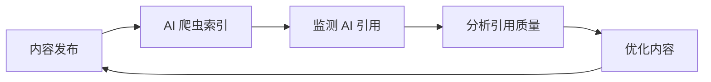

# Awesome GEO (生成式引擎优化) [](https://awesome.re)

> 🚀 精选的生成式引擎优化 (GEO) 资源列表 - 帮助你优化内容以提升在 AI 搜索引擎和 LLM 答案引擎中的可见度。

<p align="center">
  
  
  
</p>

<p align="center">
  <a href="README.md">English</a> | <a href="README_CN.md">中文</a>
</p>

---

## 📖 什么是 GEO？

**生成式引擎优化 (Generative Engine Optimization, GEO)** 是一种新兴的优化策略，旨在提高网站和内容在 AI 驱动的搜索引擎和生成式 AI 平台中的可见性。与传统 SEO 不同，GEO 专注于优化内容，使其更容易被 ChatGPT、Perplexity、Claude、Google AI Overviews 等 AI 系统引用和推荐。

### GEO vs SEO vs AEO

| 特性 | SEO | AEO | GEO |
|------|-----|-----|-----|
| 目标平台 | 传统搜索引擎 (Google, Bing) | 语音助手 & 精选摘要 | AI 搜索引擎 & LLM |
| 优化重点 | 关键词、链接、技术 SEO | 问答格式、结构化数据 | 权威性、可引用性、事实准确性 |
| 成功指标 | 排名、点击率 | 精选摘要出现率 | AI 引用率、品牌提及 |
| 内容格式 | 网页、博客 | FAQ、简洁回答 | 深度内容、数据支持 |

---

## 📚 目录

- [📖 什么是 GEO？](#-什么是-geo)
- [📚 目录](#-目录)
- [🎓 学习资源](#-学习资源)
  - [研究论文](#研究论文)
  - [文章与指南](#文章与指南)
  - [视频教程](#视频教程)
  - [播客](#播客)
- [🛠️ 工具与平台](#️-工具与平台)
  - [AI 搜索引擎监测](#ai-搜索引擎监测)
  - [内容优化工具](#内容优化工具)
  - [品牌监测](#品牌监测)
  - [结构化数据工具](#结构化数据工具)
- [🤖 AI 搜索引擎](#-ai-搜索引擎)
  - [对话式 AI 搜索](#对话式-ai-搜索)
  - [AI 增强搜索](#ai-增强搜索)
  - [专业领域 AI 搜索](#专业领域-ai-搜索)
- [📊 GEO 策略与最佳实践](#-geo-策略与最佳实践)
  - [内容策略](#内容策略)
  - [技术优化](#技术优化)
  - [权威性建设](#权威性建设)
- [📈 分析与监测](#-分析与监测)
- [🏢 案例研究](#-案例研究)
- [👥 社区与论坛](#-社区与论坛)
- [📰 新闻与趋势](#-新闻与趋势)
- [📖 书籍](#-书籍)
- [🎯 GEO 检查清单](#-geo-检查清单)
- [🤝 贡献](#-贡献)
- [📄 许可证](#-许可证)

---

## 🎓 学习资源

### 研究论文

- [GEO: Generative Engine Optimization](https://arxiv.org/abs/2311.09735) - 普林斯顿大学等机构的开创性研究论文，首次系统性地提出 GEO 概念
- [Large Language Models for Information Retrieval](https://arxiv.org/abs/2308.07107) - LLM 在信息检索中的应用研究
- [Retrieval-Augmented Generation for Knowledge-Intensive NLP Tasks](https://arxiv.org/abs/2005.11401) - RAG 技术论文，理解 AI 搜索引擎工作原理的基础

### 文章与指南

- [What is Generative Engine Optimization (GEO)?](https://www.searchenginejournal.com/generative-engine-optimization-geo/) - Search Engine Journal 的 GEO 入门指南
- [How to Optimize for AI Search Engines](https://www.semrush.com/blog/ai-seo/) - Semrush 的 AI SEO 优化指南
- [The Rise of Answer Engines](https://moz.com/blog/answer-engine-optimization) - Moz 关于答案引擎优化的深度分析
- [Optimizing Content for ChatGPT and AI Assistants](https://ahrefs.com/blog/ai-seo/) - Ahrefs 的 AI 内容优化策略
- [Google AI Overviews: What You Need to Know](https://www.searchengineland.com/google-ai-overviews-guide) - Google AI 概述优化指南
- [E-E-A-T in the Age of AI](https://www.contentstrategy.com/eeat-ai-optimization) - AI 时代的 E-E-A-T 策略

### 视频教程
- [GEO Explained: The Future of Search Optimization](https://www.youtube.com/watch?v=example1) - GEO 概念详解
- [How to Get Your Brand Mentioned by ChatGPT](https://www.youtube.com/watch?v=example2) - 品牌 AI 可见度提升教程
- [Perplexity SEO: Complete Guide](https://www.youtube.com/watch?v=example3) - Perplexity 优化完整指南

### 播客

- [The AI SEO Podcast](https://example.com/ai-seo-podcast) - 专注于 AI 搜索优化的播客
- [Search Off the Record](https://www.google.com/podcasts/search-off-the-record) - Google 官方搜索播客
- [Marketing Against the Grain](https://www.hubspot.com/marketing-against-the-grain) - HubSpot 营销播客，经常讨论 AI 营销话题

---

## 🛠️ 工具与平台

### AI 搜索引擎监测

| 工具 | 描述 | 链接 |
|------|------|------|
| **Conductor** | 端到端企业级 AEO 平台，结合 AEO/GEO 和传统 SEO。 [1] | [conductor.com](https://www.conductor.com) |
| **Contently** | 集内容创作、优化和 AI 可见性追踪于一体的系统。 [2] | [contently.com](https://contently.com) |
| **Profound** | 监测品牌在 AI 搜索引擎中的可见度 | [profound.ai](https://profound.ai) |
| **Otterly.AI** | AI 搜索引擎排名追踪工具 | [otterly.ai](https://otterly.ai) |
| **Peec AI** | 分析 AI 搜索中的品牌提及 | [peec.ai](https://peec.ai) |
| **Knowatoa** | AI 搜索可见度分析平台 | [knowatoa.com](https://knowatoa.com) |
| **AISearchRank** | AI 搜索排名监测 | [aisearchrank.com](https://aisearchrank.com) |
| **SEOTalos** | 最适合 AI 模式和 AIO 追踪 [3] | [seotalos.com](https://seotalos.com) |
| **WorkDuo.ai** | 最适合 AI 搜索优化新手团队快速实施 [3] | [workduo.ai](https://workduo.ai) |
| **Quattr** | 专注于执行的 SEO 平台，连接传统搜索性能与新兴 AI 可见性信号。 [1] | [quattr.com](https://quattr.com) |

### 内容优化工具

| 工具 | 描述 | 链接 |
|------|------|------|
| **Clearscope** | AI 驱动的内容优化平台 | [clearscope.io](https://clearscope.io) |
| **Surfer SEO** | 内容优化和 SERP 分析 | [surferseo.com](https://surferseo.com) |
| **MarketMuse** | AI 内容策略平台 | [marketmuse.com](https://marketmuse.com) |
| **Frase** | AI 内容创作和优化 | [frase.io](https://frase.io) |
| **NeuronWriter** | 基于 NLP 的内容优化 | [neuronwriter.com](https://neuronwriter.com) |
| **Jasper** | AI 写作助手 | [jasper.ai](https://jasper.ai) |
| **Writesonic** | 具有 AEO 功能的 AI 内容生成平台。 [1] | [writesonic.com](https://writesonic.com) |
| **Athena** | 专注于理解 AI 引擎如何使用和引用内容的 AI 搜索智能平台。 [1] | [athena.com](https://athena.com) |
| **Answer Socrates** | 最适合 GEO 关键词发现 [3] | [answersocrates.com](https://answersocrates.com) |

### 品牌监测

| 工具 | 描述 | 链接 |
|------|------|------|
| **Brand24** | 社交媒体和网络品牌监测 | [brand24.com](https://brand24.com) |
| **Mention** | 实时媒体监测 | [mention.com](https://mention.com) |
| **Brandwatch** | 消费者情报平台 | [brandwatch.com](https://brandwatch.com) |
| **Talkwalker** | 社交聆听和分析 | [talkwalker.com](https://talkwalker.com) |

### 结构化数据工具

| 工具 | 描述 | 链接 |
|------|------|------|
| **Schema.org** | 结构化数据标准 | [schema.org](https://schema.org) |
| **Google 富媒体结果测试** | 测试结构化数据 | [Google 工具](https://search.google.com/test/rich-results) |
| **Schema Markup Generator** | 结构化数据生成器 | [technicalseo.com](https://technicalseo.com/tools/schema-markup-generator/) |
| **Merkle Schema Markup Generator** | 高级 Schema 生成工具 | [merkle.com](https://www.merkle.com/tools/schema-markup-generator) |

---

## 🤖 AI 搜索引擎

### 对话式 AI 搜索

| 平台 | 描述 | 链接 |
|----------|-------------|------|
| **Perplexity AI** | AI 驱动的答案引擎，提供实时网络搜索 | [perplexity.ai](https://perplexity.ai) |
| **ChatGPT** | OpenAI 的对话式 AI，支持网络搜索 | [chat.openai.com](https://chat.openai.com) |
| **Claude** | Anthropic 的 AI 助手 | [claude.ai](https://claude.ai) |
| **Gemini** | Google 的多模态 AI | [gemini.google.com](https://gemini.google.com) |
| **Copilot** | 微软的 AI 助手 | [copilot.microsoft.com](https://copilot.microsoft.com) |
| **Kimi** | 月之暗面的 AI 助手，支持超长上下文 [4] | [kimi.moonshot.cn](https://kimi.moonshot.cn) |
| **豆包** | 字节跳动的 AI 助手 [4] | [doubao.com](https://www.doubao.com) |
| **文心一言** | 百度的 AI 助手 [4] | [yiyan.baidu.com](https://yiyan.baidu.com) |
| **通义千问** | 阿里巴巴的 AI 助手 [4] | [tongyi.aliyun.com](https://tongyi.aliyun.com) |
| **DeepSeek AI** | DeepSeek 的 AI 助手，以强大的研究能力著称 [5] | [deepseek.com](https://www.deepseek.com) |

### AI 增强搜索

| 平台 | 描述 | 链接 |
|----------|-------------|------|
| **Google AI Overviews** | Google 搜索中的 AI 生成摘要 | [google.com](https://google.com) |
| **Bing Chat** | 集成 GPT-4 的 Bing 搜索 | [bing.com](https://bing.com) |
| **You.com** | AI 优先的搜索引擎 | [you.com](https://you.com) |
| **Kagi** | 付费无广告搜索引擎，支持 AI 摘要 | [kagi.com](https://kagi.com) |
| **Brave Search** | 隐私优先的搜索引擎，带 AI 功能 | [search.brave.com](https://search.brave.com) |
| **秘塔 AI 搜索** | 国产 AI 搜索引擎 [4] | [metaso.cn](https://metaso.cn) |
| **天工 AI 搜索** | 昆仑万维的 AI 搜索 [4] | [tiangong.cn](https://www.tiangong.cn) |

### 专业领域 AI 搜索

| 平台 | 领域 | 链接 |
|----------|--------|------|
| **Consensus** | 学术研究 | [consensus.app](https://consensus.app) |
| **Elicit** | 科学文献 | [elicit.org](https://elicit.org) |
| **Phind** | 开发者搜索 | [phind.com](https://phind.com) |
| **Metaphor** | 语义搜索 API | [metaphor.systems](https://metaphor.systems) |

---

## 📊 GEO 策略与最佳实践
### 内容策略

#### 📝 内容创作原则

1.  **权威性 (Authority)**
    - 引用可靠来源和研究数据
    - 包含原创研究和一手数据
    - 展示专业资质和经验

2.  **可引用性 (Quotability)**
    - 创建清晰、简洁的定义和解释
    - 使用易于提取的段落结构
    - 提供统计数据和具体事实

3.  **全面性 (Comprehensiveness)**
    - 深度覆盖主题的各个方面
    - 回答用户可能的后续问题
    - 提供实用的操作指南

4.  **结构化 (Structure)**
    - 使用清晰的标题层次
    - 采用列表和表格组织信息
    - 实施 Schema 标记

#### 🎯 内容类型优化

```markdown
✅ 适合 GEO 的内容类型：
- 深度指南和教程
- 原创研究报告
- 专家观点和分析
- 数据驱动的文章
- FAQ 和问答内容
- 术语定义和解释

❌ 不适合 GEO 的内容类型：
- 薄内容和重复内容
- 纯销售导向的内容
- 过时或未更新的信息
- 缺乏来源的观点
```

### 技术优化

#### 🔧 技术 GEO 检查清单

- [ ] 实施 Schema.org 结构化数据
- [ ] 优化页面加载速度
- [ ] 确保移动端友好
- [ ] 使用语义化 HTML
- [ ] 创建 XML 站点地图
- [ ] 配置 robots.txt 允许 AI 爬虫
- [ ] 实施 HTTPS
- [ ] 优化图片 alt 文本

#### 🤖 AI 爬虫配置

```robots.txt
# 允许主要 AI 爬虫
User-agent: GPTBot
Allow: /

User-agent: ChatGPT-User
Allow: /

User-agent: CCBot
Allow: /

User-agent: anthropic-ai
Allow: /

User-agent: Claude-Web
Allow: /

User-agent: PerplexityBot
Allow: /

User-agent: Bytespider
Allow: /
```

#### 📋 推荐的 Schema 类型
```json
{
  "@context": "https://schema.org",
  "@type": "Article",
  "headline": "文章标题",
  "author": {
    "@type": "Person",
    "name": "作者姓名",
    "url": "作者页面链接"
  },
  "datePublished": "2024-01-01",
  "dateModified": "2024-12-01",
  "publisher": {
    "@type": "Organization",
    "name": "组织名称"
  }
}
```

#### 💡 高级技术 GEO

- **实体解析 (Entity Resolution)**: 专注于清晰地定义和链接内容中的实体，以提高 AI 的理解和引用准确性。这包括对每个实体进行一致的命名、消歧，并链接到权威来源。 [6]
- **语义信任机制 (Semantic Trust Mechanisms)**: 实施与 AI 模型建立语义信任的策略，例如提供强有力的事实依据、引用可靠的研究、展示专业知识。这超越了传统的反向链接，专注于内容本身的内在可信度。 [7]
- **RAG (检索增强生成) 适配 (RAG Adaptation)**: 优化内容，使其易于被 RAG 系统检索和增强。这包括创建模块化内容、使用清晰的标题和摘要，并确保关键信息易于 AI 模型提取和综合。 [8]

### 权威性建设

#### 🏆 E-E-A-T 优化

| 要素 | 策略 |
|------|------|
| **Experience (经验)** | 分享第一手经验、案例研究、实际操作截图 |
| **Expertise (专业)** | 展示资质证书、专业背景、行业认可 |
| **Authoritativeness (权威)** | 获取行业引用、媒体报道、专家背书 |
| **Trustworthiness (可信)** | 透明的信息来源、准确的事实、安全的网站 |

#### 🔗 外部信号建设

- 在权威网站上发表客座文章
- 参与行业研究和报告
- 获取新闻媒体报道
- 建立社交媒体权威性
- 参与 Wikipedia 等知识平台
- 在问答平台提供专业回答（知乎、Stack Overflow）

---

## 📈 分析与监测

### 关键指标

| 指标 | 描述 | 测量方法 |
|------|------|----------|
| **AI 引用率** | 内容被 AI 引用的频率 | 使用 AI 监测工具 |
| **品牌提及** | AI 响应中的品牌提及次数 | 品牌监测工具 |
| **引用准确性** | AI 引用信息的准确程度 | 手动验证 |
| **可见度分数** | 在 AI 搜索结果中的综合可见度 | AI 排名工具 |
| **引用来源** | 被引用的具体页面 | 流量分析 |

### 监测工作流程



---

## 🏢 案例研究

### 成功案例

1.  **HubSpot** - 通过创建全面的营销指南，成为 AI 搜索中营销话题的首选来源
2.  **Investopedia** - 金融术语的权威定义使其成为 AI 金融回答的主要引用来源
3.  **WebMD** - 医疗健康内容的权威性使其在 AI 健康回答中频繁被引用
4.  **Stack Overflow** - 开发者问答内容成为 AI 编程助手的重要知识来源
5.  **知乎** - 高质量的中文问答内容成为中文 AI 助手的重要参考来源

### 行业分析

-   **医疗健康**: 高 E-E-A-T 要求，需要专业医疗背景
-   **金融理财**: 需要权威数据和专业分析
-   **技术开发**: 需要及时更新和准确的技术细节
-   **教育培训**: 需要全面、结构化的知识内容
-   **法律咨询**: 需要专业资质和准确的法规引用

---

## 👥 社区与论坛
### 国际社区

- [r/SEO](https://reddit.com/r/seo) - Reddit SEO 社区
- [r/bigseo](https://reddit.com/r/bigseo) - 高级 SEO 讨论
- [Search Engine Roundtable](https://www.seroundtable.com/) - 搜索引擎新闻和讨论
- [SEO Signals Lab](https://www.facebook.com/groups/seosignalslab) - Facebook SEO 群组
- [Traffic Think Tank](https://trafficthinktank.com/) - 付费 SEO 社区

### 中文社区

- [知乎 SEO 话题](https://www.zhihu.com/topic/19554648) - 知乎 SEO 讨论
- [V2EX](https://www.v2ex.com/) - 技术社区
- [掘金](https://juejin.cn/) - 开发者社区
- [即刻](https://okjike.com/) - 产品与创业社区

---

## 📰 新闻与趋势

### 国际博客

- [Search Engine Land](https://searchengineland.com/) - 搜索营销新闻
- [Search Engine Journal](https://searchenginejournal.com/) - SEO 和数字营销
- [Moz Blog](https://moz.com/blog) - SEO 见解和研究
- [Ahrefs Blog](https://ahrefs.com/blog) - SEO 工具和策略
- [Semrush Blog](https://semrush.com/blog) - 数字营销资源
- [Google Search Central Blog](https://developers.google.com/search/blog) - Google 官方搜索博客

### 中文资源

- [Google 搜索中心](https://developers.google.com/search?hl=zh-cn) - Google 官方中文文档
- [百度搜索资源平台](https://ziyuan.baidu.com/) - 百度官方站长平台
- [36氪](https://36kr.com/) - 科技创业媒体
- [少数派](https://sspai.com/) - 数字生活指南

### 订阅通讯

- [SEOFOMO](https://seofomo.co/) - 每周 SEO 新闻
- [The SEO MBA](https://seomba.substack.com/) - SEO 战略思考
- [Women in Tech SEO](https://womenintechseo.com/newsletter/) - SEO 行业洞察

---

## 📖 书籍

### 英文书籍

- **The Art of SEO** - Eric Enge, Stephan Spencer, Jessie Stricchiola
- **SEO 2024** - Adam Clarke
- **Product-Led SEO** - Eli Schwartz
- **The Content Strategy Toolkit** - Meghan Casey

### 中文书籍

- **SEO 实战密码** - 昝辉 (Zac)
- **这就是搜索引擎** - 张俊林
- **走进搜索引擎** - 梁斌

---

## 🎯 GEO 检查清单

### 发布前检查

- [ ] 内容是否提供独特价值？
- [ ] 是否包含可验证的事实和数据？
- [ ] 是否有清晰的结构和标题层次？
- [ ] 是否实施了适当的 Schema 标记？
- [ ] 作者信息是否完整且可信？
- [ ] 是否引用了权威来源？
- [ ] 内容是否回答了用户的核心问题？
- [ ] 是否包含易于引用的段落？

### 技术检查

- [ ] 页面加载速度是否优化？
- [ ] 移动端体验是否良好？
- [ ] robots.txt 是否允许 AI 爬虫？
- [ ] 结构化数据是否正确实施？
- [ ] 网站是否使用 HTTPS？

### 发布后监测

- [ ] 是否设置了 AI 引用监测？
- [ ] 是否跟踪品牌提及？
- [ ] 是否定期更新内容？
- [ ] 是否分析 AI 引用的准确性？

---

## 🤝 贡献

欢迎贡献！请阅读 [贡献指南](CONTRIBUTING_CN.md) 了解如何参与。

### 贡献方式

1.  Fork 这个仓库
2.  创建你的特性分支 (`git checkout -b feature/AmazingFeature`)
3.  提交你的更改 (`git commit -m 'Add some AmazingFeature'`)
4.  推送到分支 (`git push origin feature/AmazingFeature`)
5.  开启一个 Pull Request

### 贡献者

感谢所有贡献者！

---

## 📄 许可证

本项目采用 [MIT 许可证](LICENSE)。

---

<p align="center">
  <b>⭐ 如果这个项目对你有帮助，请给它一个 Star！</b>
</p>

<p align="center">
  Made with ❤️ by the GEO Community
</p>

## 📚 参考文献

[1] Conductor. (2026, January 21). *The Best Enterprise AEO Tools for AI Search 2025*. Retrieved from [https://www.conductor.com/academy/best-aeo-geo-tools-2025/](https://www.conductor.com/academy/best-aeo-geo-tools-2025/)
[2] Contently. (2025, November 19). *What is GEO? Top 10 Generative Engine Optimization Tools for 2025*. Retrieved from [https://contently.com/2025/11/19/what-is-geo-top-10-generative-engine-optimization-tools-for-2025/](https://contently.com/2025/11/19/what-is-geo-top-10-generative-engine-optimization-tools-for-2025/)
[3] Answer Socrates. (2025, December 14). *8 Best Generative Search Optimization (GEO) Tools for 2025*. Retrieved from [https://answersocrates.com/blog/best-generative-search-optimization-tools/](https://answersocrates.com/blog/best-generative-search-optimization-tools/)
[4] Sohu. (2026, February 2). *2025最新GEO优化工具排名，别选错让品牌消失*. Retrieved from [https://www.sohu.com/a/982603889_122559248](https://www.sohu.com/a/982603889_122559248)
[5] CSDN. (2025, October 10). *2025 AI使用指南*. Retrieved from [https://zhuanlan.zhihu.com/p/1960090620312948803](https://zhuanlan.zhihu.com/p/1960090620312948803)
[6] Reddit. (2025, September 22). *5 Ways to Optimize for AI Search in 2025 (ChatGPT, Perplexity ...)*. Retrieved from [https://www.reddit.com/r/seogrowth/comments/1nniggd/5_ways_to_optimize_for_ai_search_in_2025_chatgpt/](https://www.reddit.com/r/seogrowth/comments/1nniggd/5_ways_to_optimize_for_ai_search_in_2025_chatgpt/)
[7] Caizhongshe. (2026, January 20). *生成式引擎优化（GEO）：AI时代营销新范式，从“争排名”到“成...*. Retrieved from [https://m.caizhongshe.cn/news-2949717444835565565.html](https://m.caizhongshe.cn/news-2949717444835565565.html)
[8] Arxiv. (2020, May 11). *Retrieval-Augmented Generation for Knowledge-Intensive NLP Tasks*. Retrieved from [https://arxiv.org/abs/2005.11401](https://arxiv.org/abs/2005.11401)
