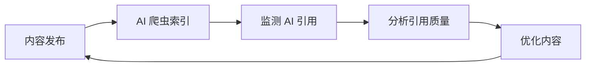

# Awesome GEO [](https://awesome.re)

> 生成式引擎优化 (GEO) — 优化内容以提升在 AI 搜索引擎和 LLM 答案引擎（如 ChatGPT、Perplexity、Claude、Google AI Overviews）中的可见度。

<p align="center">
  <a href="README.md">English</a> | <a href="README_CN.md">中文</a>
</p>

## 目录

- [学习资源](#学习资源)
- [工具与平台](#工具与平台)
- [AI 搜索引擎](#ai-搜索引擎)
- [GEO 策略与最佳实践](#geo-策略与最佳实践)
- [分析与监测](#分析与监测)
- [案例研究](#案例研究)
- [社区与论坛](#社区与论坛)
- [新闻与趋势](#新闻与趋势)
- [书籍](#书籍)
- [GEO 检查清单](#geo-检查清单)


## 学习资源

### 研究论文

- [GEO: Generative Engine Optimization](https://arxiv.org/abs/2311.09735) - 普林斯顿大学等机构的开创性研究论文，首次系统性地提出 GEO 概念，展示高达 40% 的可见度提升。
- [Generative Engine Optimization: How to Dominate AI Search](https://arxiv.org/abs/2509.08919) - 2025 年综合研究，揭示 AI 搜索引擎对 earned media（第三方权威来源）的系统性偏好。
- [AutoGEO: What Generative Search Engines Like and How to Optimize Web Content Cooperatively](https://openreview.net/forum?id=K8EinVWtUB) - ICLR 2026 论文，提出 AutoGEO 框架，自动学习生成式引擎偏好并提取优化规则。
- [E-GEO: A Testbed for Generative Engine Optimization in E-Commerce](https://arxiv.org/abs/2511.20867) - 首个电商领域 GEO 基准测试，包含 7000+ 产品查询，评估 15 种重写策略。
- [Large Language Models for Information Retrieval](https://arxiv.org/abs/2308.07107) - LLM 在信息检索中的应用研究。
- [Retrieval-Augmented Generation for Knowledge-Intensive NLP Tasks](https://arxiv.org/abs/2005.11401) - RAG 技术论文，理解 AI 搜索引擎工作原理的基础。
- [BRIGHT: A Realistic and Challenging Benchmark for Reasoning-Intensive Retrieval](https://arxiv.org/abs/2407.12883) - 评估推理密集型 AI 搜索场景中检索能力的基准测试。
- [Search-o1: Agentic Search-Enhanced LLM Reasoning](https://arxiv.org/abs/2501.05366) - 结合智能体 RAG 与 LLM 推理的复杂搜索任务框架。
- [Is ChatGPT Good at Search?](https://arxiv.org/abs/2304.09542) - ChatGPT 搜索质量的实证评估，为对话式 AI 优化提供洞察。

### 文章与指南

- [Mastering Generative Engine Optimization in 2026: Full Guide](https://searchengineland.com/mastering-generative-engine-optimization-in-2026-full-guide-469142) - Search Engine Land 的 2026 年 GEO 全面指南，涵盖策略、衡量和实施。
- [Generative Engine Optimization (GEO): How to Win in AI Search](https://backlinko.com/generative-engine-optimization-geo) - Backlinko 数据驱动的 GEO 实操指南。
- [Generative Engine Optimization (GEO): A Marketer's Guide in 2026](https://www.webfx.com/blog/ai/generative-engine-optimization/) - WebFX 的营销人员 GEO 指南。
- [Complete Guide to Generative Engine Optimization (GEO) 2026](https://www.promptmonitor.io/blog/generative-engine-optimization) - Prompt Monitor 的 GEO 分步实施指南。
- [What is Generative Engine Optimization (GEO)?](https://www.searchenginejournal.com/generative-engine-optimization-geo/) - Search Engine Journal 的 GEO 入门指南。
- [How to Optimize for AI Search Engines](https://www.semrush.com/blog/ai-seo/) - Semrush 的 AI SEO 优化指南。
- [The Rise of Answer Engines](https://moz.com/blog/answer-engine-optimization) - Moz 关于答案引擎优化的深度分析。
- [Optimizing Content for ChatGPT and AI Assistants](https://ahrefs.com/blog/ai-seo/) - Ahrefs 的 AI 内容优化策略。
- [How to Optimize for Google AI Overviews 2026](https://becomingseo.com/insights/aeo-geo/optimize-for-google-ai-overviews/) - 2026 年 Google AI 概述优化完整指南。

### 视频教程

- [Forget SEO Hacks — GEO Is About Credibility, Clarity, and Control](https://www.youtube.com/watch?v=-PFBgavuFrs) - 深度 GEO 策略，聚焦通过权威性构建 AI 可见度。
- [How to Win in Generative Engine Optimization (GEO): Playbook from +30 Sites](https://www.youtube.com/watch?v=JMaDW1uOzY0) - Embarque 的实战 GEO 框架，含真实案例数据（27K+ AI 访问量）。
- [How to Rank in ChatGPT (SearchGPT SEO Guide 2026)](https://www.youtube.com/watch?v=0wF7Fru91Cw) - 在 ChatGPT、Perplexity 等 AI 搜索引擎中获得排名的分步清单。
- [LLM SEO: How to Get Mentioned First on ChatGPT, Perplexity, and Grok](https://www.youtube.com/watch?v=gLawGsda_1s) - AI 搜索引擎内容优化策略实操演示。

### 播客

- [Marketing Against the Grain](https://www.hubspot.com/marketing-against-the-grain) - HubSpot 营销播客，经常讨论 AI 营销和 GEO 话题。
- [SEOFOMO Weekly](https://seofomo.co/) - Aleyda Solis 的每周 SEO 与 AI 搜索新闻播客。


## 工具与平台

### AI 搜索引擎监测

| 工具                 | 描述                                                                        | 链接                                               |
| ------------------ | ------------------------------------------------------------------------- | ------------------------------------------------ |
| **AnswerLens**     | 面向 B2B SaaS 的免费公开证据审查工具，检查可抓取 URL、`llms.txt`、定价页、对比页和证明页；付费报告是后续路径 | [app.sfdj.net](https://app.sfdj.net/)            |
| **Geol.ai**        | 首个综合性 GEO 平台，50+ 因素质量评分引擎，支持 WordPress、Shopify、Wix 等 CMS 集成               | [geol.ai](https://geol.ai)                       |
| **OptimizeGEO**    | AI 搜索营销智能平台，追踪可见度评分、声量份额和情感分析（ISO 27001、SOC 2 合规）                         | [optimizegeo.ai](https://www.optimizegeo.ai)     |
| **Conductor**      | 端到端企业级 AEO 平台，结合 AEO/GEO 和传统 SEO                                          | [conductor.com](https://www.conductor.com)       |
| **Contently**      | 集内容创作、优化和 AI 可见性追踪于一体的系统                                                  | [contently.com](https://contently.com)           |
| **Profound**       | 深度分析与多语言支持的 AI 品牌可见度监测                                                    | [profound.ai](https://profound.ai)               |
| **Otterly.AI**     | AI 搜索引擎排名追踪工具                                                             | [otterly.ai](https://otterly.ai)                 |
| **Peec AI**        | 分析 AI 搜索中的品牌提及                                                            | [peec.ai](https://peec.ai)                       |
| **Ezeo**           | AI 驱动的 SEO、GEO 和 AEO 平台，追踪 ChatGPT、Claude、Perplexity、Gemini、Grok 和 Reddit | [ezeo.ai](https://ezeo.ai)                       |
| **Prompt Monitor** | 基于 Prompt 级别分析的 AI 搜索性能追踪和优化                                              | [promptmonitor.io](https://www.promptmonitor.io) |
| **Knowatoa**       | AI 搜索可见度分析平台                                                              | [knowatoa.com](https://knowatoa.com)             |
| **SEOTalos**       | 最适合 AI 模式和 AIO 追踪                                                         | [seotalos.com](https://seotalos.com)             |
| **WorkDuo.ai**     | 最适合 AI 搜索优化新手团队快速实施                                                       | [workduo.ai](https://workduo.ai)                 |
| **Quattr**         | 专注于执行的 SEO 平台，连接传统搜索性能与新兴 AI 可见性信号                                        | [quattr.com](https://quattr.com)                 |

### 内容优化工具

| 工具                  | 描述                                                                            | 链接                                               |
| ------------------- | ----------------------------------------------------------------------------- | ------------------------------------------------ |
| **Clearscope**      | AI 驱动的内容优化平台                                                                  | [clearscope.io](https://clearscope.io)           |
| **Surfer SEO**      | 内容优化和 SERP 分析                                                                 | [surferseo.com](https://surferseo.com)           |
| **MarketMuse**      | AI 内容策略平台                                                                     | [marketmuse.com](https://marketmuse.com)         |
| **Frase**           | 智能 SEO 和 GEO 平台，集 AI 研究、内容创作和实时 GEO 评分于一体，支持 ChatGPT、Perplexity、Claude、Gemini | [frase.io](https://frase.io)                     |
| **NeuronWriter**    | 基于 NLP 的内容优化                                                                  | [neuronwriter.com](https://neuronwriter.com)     |
| **Writesonic**      | 具有 AEO 功能的 AI 内容生成平台                                                          | [writesonic.com](https://writesonic.com)         |
| **Answer Socrates** | 最适合 GEO 关键词发现                                                                 | [answersocrates.com](https://answersocrates.com) |

### 品牌监测

| 工具             | 描述          | 链接                                       |
| -------------- | ----------- | ---------------------------------------- |
| **Brand24**    | 社交媒体和网络品牌监测 | [brand24.com](https://brand24.com)       |
| **Mention**    | 实时媒体监测      | [mention.com](https://mention.com)       |
| **Brandwatch** | 消费者情报平台     | [brandwatch.com](https://brandwatch.com) |
| **Talkwalker** | 社交聆听和分析     | [talkwalker.com](https://talkwalker.com) |

### 结构化数据工具

| 工具                          | 描述                          | 链接                                                                          |
| --------------------------- | --------------------------- | --------------------------------------------------------------------------- |
| **Schema.org**              | 结构化数据标准                     | [schema.org](https://schema.org)                                            |
| **Google 富媒体结果测试**          | 测试结构化数据                     | [Google 工具](https://search.google.com/test/rich-results)                    |
| **Schema Markup Generator** | 结构化数据生成器                    | [technicalseo.com](https://technicalseo.com/tools/schema-markup-generator/) |
| **Schema Pro**              | WordPress 自动化 Schema 标记生成插件 | [wpschema.com](https://wpschema.com)                                        |

### AI 引用与可见度分析

| 工具                            | 描述                                                    | 链接                                                     |
| ----------------------------- | ----------------------------------------------------- | ------------------------------------------------------ |
| **Maximus Labs**              | 跨 10+ AI 平台追踪品牌提及和引用的 AI 可见度分析                        | [maximuslabs.ai](https://www.maximuslabs.ai)           |
| **Seer Interactive AI Tools** | 理解 AI 引用模式的 AI 搜索分析套件                                 | [seerinteractive.com](https://www.seerinteractive.com) |
| **Originality.ai**            | AI 内容检测和优化工具，确保内容真实性以服务 AI 搜索                         | [originality.ai](https://originality.ai)               |
| **BrightEdge AI Search**      | 跨 Google AI Overviews 和 Bing Copilot 追踪 AI 搜索可见度的企业平台 | [brightedge.com](https://www.brightedge.com)           |
| **seoClarity**                | 带有 GEO 分析模块的 AI 驱动企业内容优化平台                            | [seoclarity.net](https://www.seoclarity.net)           |
| **Botify**                    | 具有 AI 搜索就绪度评分和爬虫优化的企业 SEO 平台                          | [botify.com](https://www.botify.com)                   |


## AI 搜索引擎

### 对话式 AI 搜索

| 平台                 | 描述                                                    | 链接                                                     |
| ------------------ | ----------------------------------------------------- | ------------------------------------------------------ |
| **ChatGPT Search** | OpenAI 的对话式 AI，集成网络搜索功能，2025 年 2 月起向所有用户开放            | [chatgpt.com](https://chatgpt.com)                     |
| **Perplexity AI**  | AI 驱动的答案引擎，提供实时网络搜索和来源引用                              | [perplexity.ai](https://perplexity.ai)                 |
| **Grok**           | xAI 的 AI 助手，搭载 DeepSearch 功能，支持跨网络和 X（Twitter）的实时多轮推理 | [x.ai/grok](https://x.ai/grok)                         |
| **Claude**         | Anthropic 的 AI 助手，支持网络搜索                              | [claude.ai](https://claude.ai)                         |
| **Gemini**         | Google 的多模态 AI，深度整合 Google 搜索                         | [gemini.google.com](https://gemini.google.com)         |
| **Copilot**        | 微软的 AI 助手，基于 GPT-4 集成 Bing 搜索                         | [copilot.microsoft.com](https://copilot.microsoft.com) |
| **DeepSeek AI**    | DeepSeek 的 AI 助手，以强大的研究和推理能力著称                        | [deepseek.com](https://www.deepseek.com)               |

### AI 增强搜索

| 平台                      | 描述                  | 链接                                           |
| ----------------------- | ------------------- | -------------------------------------------- |
| **Google AI Overviews** | Google 搜索中的 AI 生成摘要 | [google.com](https://google.com)             |
| **Bing Chat**           | 集成 GPT-4 的 Bing 搜索  | [bing.com](https://bing.com)                 |
| **You.com**             | AI 优先的搜索引擎          | [you.com](https://you.com)                   |
| **Kagi**                | 付费无广告搜索引擎，支持 AI 摘要  | [kagi.com](https://kagi.com)                 |
| **Brave Search**        | 隐私优先的搜索引擎，带 AI 功能   | [search.brave.com](https://search.brave.com) |

### 专业领域 AI 搜索

| 平台            | 领域                         | 链接                                           |
| ------------- | -------------------------- | -------------------------------------------- |
| **Consensus** | 学术研究                       | [consensus.app](https://consensus.app)       |
| **Elicit**    | 科学文献                       | [elicit.org](https://elicit.org)             |
| **Phind**     | 开发者搜索                      | [phind.com](https://phind.com)               |
| **Metaphor**  | 语义搜索 API                   | [metaphor.systems](https://metaphor.systems) |
| **Tavily**    | 面向智能体和 RAG 应用的 AI 原生搜索 API | [tavily.com](https://tavily.com)             |
| **Hebbia**    | AI 驱动的企业文档搜索与分析            | [hebbia.com](https://www.hebbia.com)         |
| **Liner**     | AI 驱动的学术和研究搜索引擎            | [liner.ai](https://liner.ai)                 |
| **SearchGPT** | OpenAI 的实验性独立 AI 搜索界面      | [searchgpt.com](https://searchgpt.com)       |


## GEO 策略与最佳实践

### 核心行业数据

| 数据指标                           | 数值                                   | 来源                                                |
| ------------------------------ | ------------------------------------ | ------------------------------------------------- |
| AI 搜索访客转化率 vs 传统自然搜索           | **4.4 倍**                            | Semrush AI Search Study                           |
| AI 搜索流量预计超越传统搜索的年份             | **2028 年**（若 Google AI Mode 成为默认则更早） | Semrush AI Search Study                           |
| AI 推荐访问量（2025 年 6 月）           | **约 11.3 亿次**，同比增长 357%              | AI Referral Traffic Research                      |
| ChatGPT 占 AI 推荐流量份额            | **85.79%**                           | Semrush AI Traffic Data                           |
| ChatGPT 引用来自 Google 排名 21+ 的页面 | **约 90%**                            | Semrush AI Search Study                           |
| AI Overviews 出现率               | 约 **15%** 的关键词                       | [Semrush Sensor](https://www.semrush.com/sensor/) |
| AI 响应中的品牌提及率                   | 非品牌查询的 **26-39%**                    | Semrush AI Mentions Study                         |
| B2B AI 搜索转化率 vs 传统搜索           | **6-27 倍**                           | Backlinko 2025 Analysis                           |

### AI 搜索对用户购买旅程的影响

| 阶段     | 用户提示词示例                 | AI 回答价值              | 品牌机会       |
| ------ | ----------------------- | -------------------- | ---------- |
| **了解** | "男士跑鞋的最佳品牌是什么？"         | 品牌在回答中被提及，在答案中更早获得曝光 | 品牌曝光和初始认知  |
| **考虑** | "对比前三名主打耐穿性与时尚感的男士跑鞋品牌" | AI 对比品牌，提供多个选项       | 在真实对话中塑造认知 |
| **决策** | "今天我可以在哪里买到这些跑鞋？"       | AI 推荐产品和品牌，直接影响用户决策  | 直接影响转化     |
| **购买** | "分享此品牌和产品的评论"           | AI 让用户评论和口碑更可信       | 长期权威资产     |
| **推荐** | "我所在地区最划算的男士跑鞋交易"       | AI 推荐购买选项（GPT 购物）    | 来自推荐的转化    |

### 内容策略

#### 内容创作原则

| 原则       | 关键行动                                   |
| -------- | -------------------------------------- |
| **权威性**  | 引用可靠来源和研究数据；包含原创研究和一手数据；展示专业资质和经验。     |
| **可引用性** | 创建清晰、简洁的定义和解释；使用易于提取的段落结构；提供统计数据和具体事实。 |
| **全面性**  | 深度覆盖主题的各个方面；回答用户可能的后续问题；提供实用的操作指南。     |
| **结构化**  | 使用清晰的标题层次；采用列表和表格组织信息；实施 Schema 标记。    |

#### 内容类型优化

```markdown
✅ 适合 GEO 的内容类型：
- 深度指南和教程
- 原创研究报告
- 专家观点和分析
- 数据驱动的文章
- FAQ 和问答内容
- 术语定义和解释

❌ 不适合 GEO 的内容类型：
- 薄内容和重复内容
- 纯销售导向的内容
- 过时或未更新的信息
- 缺乏来源的观点
```

#### 最易获得 AI 引用的内容类型

> 来源：Semrush — What Are AI Citations & How Do I Get Them?

| 内容类型      | 描述                 | 为什么有效                   |
| --------- | ------------------ | ----------------------- |
| **原创研究**  | 回答以前未被有效回答的问题的研究   | LLM 可以使用你提供的证据来支持具体的主张  |
| **案例研究**  | 展示产品、服务或策略成功的深度故事  | LLM 可以使用你的案例研究来支持具体的建议  |
| **思想领导力** | 表达原创想法或观点以影响他人的文章  | LLM 通常希望分享独特而多样的观点      |
| **新闻内容**  | 关于当前或持续事件的最新、准确的文章 | LLM 无法依赖预训练数据来分析最近发生的事件 |
| **品牌内容**  | 关于你的业务和产品的高质量内容    | LLM 可以信任你提供关于你品牌的最准确信息  |

让内容对 LLM 更友好的技巧：
- 编写独立可理解的句子和段落（"可分块"内容）。
- 使用描述性子标题和正确的 HTML 标题标签组织内容。
- 添加有用的图片和视频以获得多媒体引用。
- 提及相关实体和概念以提升语义相关性。
- 避免 NLP 系统难以理解的诗意、模糊或歧义性语言。

### 技术优化

#### FAST 框架：AI 可爬性评估

> 来源：Semrush — Why Site Health Is Vital For AI Search Visibility

FAST 框架帮助团队快速评估 AI 爬虫就绪度：

| 维度                      | 核心问题                        | 关键行动                                                               |
| ----------------------- | --------------------------- | ------------------------------------------------------------------ |
| **F - Fetchable（可获取）**  | AI 能否在不渲染的情况下检索和读取你的 HTML？  | 关闭 JS 测试页面；确保核心信息在初始 HTML 中；实施 SSR                                 |
| **A - Accessible（可访问）** | 不执行脚本时，你的关键内容是否可理解？         | 添加 alt 文本和说明；使用正确的标题层次（H1-H6）；使用语义化 HTML5 元素                       |
| **S - Structured（结构化）** | 你是否使用了 schema、语义标签和清晰的层次结构？ | 创建定义框和列表式内容层次；使用 Product/Article/Organization schema；实施 FAQ schema |
| **T - Trim（精简）**        | 你是否发送了所需的内容，没有臃肿和噪音？        | 清理不必要的追踪脚本；压缩资源和优化图片；减少 JS 依赖                                      |

> 快速提示：关闭 JavaScript 加载你的前 20 个页面，你看到的内容大致就是 AI 搜索爬虫看到的内容。

#### 技术 GEO 检查清单

- [ ] 实施 Schema.org 结构化数据
- [ ] 优化页面加载速度
- [ ] 确保移动端友好
- [ ] 使用语义化 HTML
- [ ] 创建 XML 站点地图
- [ ] 配置 robots.txt 允许 AI 爬虫
- [ ] 创建 llms.txt 提供结构化的 AI 可读网站信息
- [ ] 实施 HTTPS
- [ ] 优化图片 alt 文本
- [ ] 确保服务端渲染以提高 AI 爬虫可访问性

#### AI 爬虫配置

```robots.txt
# 允许主要 AI 搜索爬虫（影响实时 AI 响应）
User-agent: GPTBot
Allow: /

User-agent: OAI-SearchBot
Allow: /

User-agent: ChatGPT-User
Allow: /

User-agent: ClaudeBot
Allow: /

User-agent: PerplexityBot
Allow: /

User-agent: Google-Extended
Allow: /

User-agent: Applebot-Extended
Allow: /

# 允许 AI 训练爬虫（影响未来模型训练）
User-agent: CCBot
Allow: /

User-agent: anthropic-ai
Allow: /

User-agent: Bytespider
Allow: /
```

#### llms.txt 配置

[llms.txt](https://llmstxt.org/) 是一个新兴标准（类似 robots.txt），为 AI 模型提供结构化的、机器可读的网站信息。正确实施 llms.txt 的网站在 AI 响应中的品牌描述准确度提高约 24%。

```markdown
# 你的品牌名称

> 1-3 句话的业务摘要。

## 联系方式
- 网站: https://example.com
- 邮箱: hello@example.com

## 服务
- [服务 1](https://example.com/service-1): 简要描述
- [服务 2](https://example.com/service-2): 简要描述

## 关键信息
- [关于我们](https://example.com/about)
- [文档](https://example.com/docs)
```

#### 推荐的 Schema 类型

> Schema 标记帮助 AI 系统更好地理解和展示你的内容。Google [推荐](https://developers.google.com/search/docs/appearance/structured-data/intro-structured-data)使用 JSON-LD 实施 Schema 标记。

```json
{
  "@context": "https://schema.org",
  "@type": "Article",
  "headline": "文章标题",
  "author": {
    "@type": "Person",
    "name": "作者姓名",
    "url": "作者页面链接"
  },
  "datePublished": "2024-01-01",
  "dateModified": "2024-12-01",
  "publisher": {
    "@type": "Organization",
    "name": "组织名称"
  }
}
```

#### 高级技术 GEO

| 技术         | 描述                                                                        |
| ---------- | ------------------------------------------------------------------------- |
| **实体解析**   | 专注于清晰地定义和链接内容中的实体，以提高 AI 的理解和引用准确性。这包括对每个实体进行一致的命名、消歧，并链接到权威来源。           |
| **语义信任机制** | 实施与 AI 模型建立语义信任的策略，例如提供强有力的事实依据、引用可靠的研究、展示专业知识。这超越了传统的反向链接，专注于内容本身的内在可信度。 |
| **RAG 适配** | 优化内容，使其易于被 RAG 系统检索和增强。这包括创建模块化内容、使用清晰的标题和摘要，并确保关键信息易于 AI 模型提取和综合。        |

#### AI 平台产品信息流（Product Feed）

> 来源：Semrush — What Are AI Citations & How Do I Get Them?

产品信息流是结构化的产品详情文件，帮助 AI 系统更好地理解和展示你的产品信息，以获取更多产品引用。提交你的产品信息流到：

| 平台            | 提交方式                                                                           | 状态                           |
| ------------- | ------------------------------------------------------------------------------ | ---------------------------- |
| **Google**    | [Google Merchant Center](https://business.google.com/us/merchant-center/)      | 已开放 - 支持 Google AI Mode 产品引用 |
| **Microsoft** | [Microsoft Merchant Center](https://help.ads.microsoft.com/#apex/3/en/51085/1) | 已开放 - 支持 Copilot 产品结果        |
| **ChatGPT**   | [登记兴趣](https://openai.com/chatgpt/search-product-discovery/)                   | 即将推出 - 尚未开放信息流提交             |

#### 3 步 AI 搜索就绪计划

> 来源：Semrush — Why Site Health Is Vital For AI Search Visibility

**第 1 步 - 评估：**
1. 使用 AI 搜索监测工具评估当前 AI 引用和提及率基准
2. 关闭浏览器 JavaScript 测试内容提取
3. 对前 20 个页面进行纯 HTML 爬取审核

**第 2 步 - 快速优化：**
1. 将页面加载时间优化到 2 秒以内
2. 为最重要的页面添加 FAQ schema
3. 清理 robots.txt 并实施/更新 llms.txt

**第 3 步 - 结构化改进：**
1. 为产品、文章或服务添加结构化数据
2. 使用语义化 HTML 创建清晰的内容层次结构
3. 为关键内容路径实施服务端渲染

### 权威性建设

#### E-E-A-T 优化

| 要素                         | 策略                  |
| -------------------------- | ------------------- |
| **Experience (经验)**        | 分享第一手经验、案例研究、实际操作截图 |
| **Expertise (专业)**         | 展示资质证书、专业背景、行业认可    |
| **Authoritativeness (权威)** | 获取行业引用、媒体报道、专家背书    |
| **Trustworthiness (可信)**   | 透明的信息来源、准确的事实、安全的网站 |

#### 外部信号建设

- 在权威网站上发表客座文章。
- 参与行业研究和报告。
- 获取新闻媒体报道。
- 建立社交媒体权威性。
- 参与 Wikipedia 等知识平台。
- 在问答平台提供专业回答（知乎、Stack Overflow）。

#### AI 品牌提及优化

> 来源：Semrush — AI Mentions: How to Get LLMs to Mention Your Brand

AI 品牌提及是 AI 生成响应中对品牌的引用。LLM 在 **26-39%** 的非品牌查询响应中包含品牌提及。关键策略：

**获取更多 AI 品牌提及：**
- 发布关于品牌、产品和具体用例的深度内容
- 在上下文丰富的第三方内容中获取品牌提及（博客文章、新闻、Reddit、知乎）
- 利用联盟营销和 KOL 营销制造话题
- 将品牌列入相关的高质量目录
- 创建你的产品与竞品的对比内容

**改善 AI 品牌提及的情感：**
- 收集并根据客户反馈采取行动
- 发布数据支持的案例研究证明产品/服务的成功
- 主动管理在线评论
- 加强并一致传达你的独特价值主张（UVP）
- 制定负面提及的危机管理策略

**新兴品牌面临的挑战：**
- AI 系统偏向数字足迹广泛的品牌
- 知名度较低的品牌可能收到保守性语言（"可能值得考虑"）
- 突围需要积极的数字足迹建设


## 分析与监测

### 主流 LLM 的引用来源对比

> 来源：Semrush — AI Mode Comparison Study

| 平台                      | 域名重合率（vs Google Top 10） | URL 重合率（vs Google Top 10） | 关键特点                                |
| ----------------------- | ----------------------- | ------------------------- | ----------------------------------- |
| **Perplexity**          | 91%                     | 82%                       | 与 Google Top 10 一致性最高               |
| **Google AI Overviews** | 86%                     | 67%                       | 高度依赖 Google 传统搜索索引                  |
| **Google AI Mode**      | 54%                     | 35%                       | 更独立的检索行为；侧边栏平均约 7 个不同域名             |
| **ChatGPT**             | 最低                      | 最低                        | 偏向 Bing 排名体系；主要引用 Google 排名 21+ 的页面 |

核心发现：Reddit、YouTube 和 Facebook 出现在 **68%+** 的 AI Mode 带额外链接的结果中。Quora 是 Google AI Overviews 中被引用最多的网站，Reddit 排第二。ChatGPT 链接中 **50%** 指向商业/服务网站。Google 域名级别的强排名与 AI 引用频率高度相关。LLM 常从同一受信域名引用不同页面。商业/交易类查询触发的响应长度是信息类查询的 **约 2 倍**。

### AI 推荐流量（按平台）

> 来源：Semrush — AI Referral Traffic（2025 年 7 月数据）

| AI 平台      | 月访问量   | 流量份额   |
| ---------- | ------ | ------ |
| ChatGPT    | 52.4 亿 | 85.79% |
| Gemini     | 2.88 亿 | 4.70%  |
| Perplexity | 1.74 亿 | 2.84%  |
| Grok       | 1.53 亿 | 2.50%  |
| Claude     | 1.37 亿 | 2.23%  |
| Copilot    | 9780 万 | 1.60%  |
| Meta AI    | 1660 万 | 0.27%  |

### AI 流量追踪设置（GA4）

在 Google Analytics 4 中追踪 AI 推荐流量，使用以下正则表达式创建自定义渠道分组：

```
Source matches regex:
.*(chatgpt\.com|openai\.com|perplexity\.ai|claude\.ai|gemini\.google\.com|bard\.google\.com|you\.com|search\.brave\.com|copilot\.microsoft\.com).*
```

设置步骤：
1. 进入 GA4 → 管理 → 数据显示 → 渠道分组
2. 添加新渠道，命名为"AI 推荐流量"
3. 设置条件：来源 → 匹配正则表达式 → 粘贴上述 regex
4. 将 AI 流量分组移到推荐分组上方
5. 保存并应用到获取报告

### 关键指标

| 指标         | 描述               | 测量方法       |
| ---------- | ---------------- | ---------- |
| **AI 引用率** | 内容被 AI 引用的频率     | 使用 AI 监测工具 |
| **品牌提及**   | AI 响应中的品牌提及次数    | 品牌监测工具     |
| **引用准确性**  | AI 引用信息的准确程度     | 手动验证       |
| **可见度分数**  | 在 AI 搜索结果中的综合可见度 | AI 排名工具    |
| **引用来源**   | 被引用的具体页面         | 流量分析       |

### 监测工作流程


```mermaid
graph LR
    A[内容发布] --> B[AI 爬虫索引]
    B --> C[监测 AI 引用]
    C --> D[分析引用质量]
    D --> E[优化内容]
    E --> A
```


## 案例研究

### 成功案例

| 品牌                 | GEO 成就                                |
| ------------------ | ------------------------------------- |
| **HubSpot**        | 通过创建全面的营销指南，成为 AI 搜索中营销话题的首选来源。       |
| **Investopedia**   | 金融术语的权威定义使其成为 AI 金融回答的主要引用来源。         |
| **WebMD**          | 医疗健康内容的权威性使其在 AI 健康回答中频繁被引用。          |
| **Stack Overflow** | 开发者问答内容成为 AI 编程助手的重要知识来源。             |
| **NerdWallet**     | 优化的金融比较内容在个人理财查询中实现 78% 的 AI 引用率。     |
| **Healthline**     | 以 E-E-A-T 为核心的健康内容策略使 AI 搜索可见度提升 3 倍。 |
| **Shopify**        | 电商教育内容成为网店设置查询中 AI 首要引用来源。            |
| **Canva**          | 设计教程内容策略在创意工具推荐中实现 AI 可见度领先。          |
| **Zapier**         | 集成指南和工作流教程在自动化查询中持续被 AI 助手引用。         |

### GEO 效果数据（2025-2026）

| 案例                       | 效果                                        |
| ------------------------ | ----------------------------------------- |
| **B2B SaaS 公司**          | AI 可见度提升 340%，合格线索增长 230%                 |
| **电商品牌**                 | 可见度提升 450%，AI 购物推荐率达 85%                  |
| **知识平台**                 | 可见度提升 520%，跨 AI 平台提及率达 92%                |
| **内容出版商**                | 可见度提升 380%，占领 60% 的垂直 AI 流量               |
| **LS Building Products** | 自然流量增长 67%，Google AI Overviews 提及量增长 540% |
| **医疗 SaaS 创业公司**         | 实施结构化数据和 llms.txt 后 AI 引用量增长 280%         |
| **法律科技平台**               | 权威性建设活动后 AI 推荐流量增长 190%                   |
| **教育科技公司**               | 5 语种多语言 GEO 策略实现 AI 可见度提升 410%            |
| **旅游聚合平台**               | Schema 标记和 FAQ 优化后 AI 推荐增长 320%           |
| **金融科技应用**               | 定向专家内容策略使 AI 品牌提及增长 250%                  |

B2B 品牌报告显示，来自 AI 搜索平台的转化率比传统搜索高 **6-27 倍**。Backlinko 2025 年分析显示，来自 LLM 的网站流量同比增长 **800%**（2024 Q2 → 2025 Q2）。

### 行业分析

| 行业       | GEO 注意事项               |
| -------- | ---------------------- |
| **医疗健康** | 高 E-E-A-T 要求，需要专业医疗背景。 |
| **金融理财** | 需要权威数据和专业分析。           |
| **技术开发** | 需要及时更新和准确的技术细节。        |
| **教育培训** | 需要全面、结构化的知识内容。         |
| **电子商务** | 针对 AI 购物推荐的产品内容优化。     |
| **法律咨询** | 需要专业资质和准确的法规引用。        |


## 社区与论坛

- [r/SEO](https://reddit.com/r/seo) - Reddit SEO 社区。
- [r/bigseo](https://reddit.com/r/bigseo) - 高级 SEO 讨论。
- [r/ArtificialIntelligence](https://reddit.com/r/ArtificialIntelligence) - Reddit AI 社区，经常讨论 GEO 话题。
- [Search Engine Roundtable](https://www.seroundtable.com/) - 搜索引擎新闻和讨论。
- [SEO Signals Lab](https://www.facebook.com/groups/seosignalslab) - Facebook SEO 群组。
- [Traffic Think Tank](https://trafficthinktank.com/) - 付费 SEO 社区。
- [Superpath](https://superpath.co/) - 内容营销社区，GEO 话题日益增长。
- [GEO Community on Discord](https://discord.gg/geo-optimization) - 专注 GEO 策略的活跃 Discord 服务器。


## 新闻与趋势

- [Search Engine Land](https://searchengineland.com/) - 搜索营销新闻。
- [Search Engine Journal](https://searchenginejournal.com/) - SEO 和数字营销。
- [Moz Blog](https://moz.com/blog) - SEO 见解和研究。
- [Ahrefs Blog](https://ahrefs.com/blog) - SEO 工具和策略。
- [Semrush Blog](https://semrush.com/blog) - 数字营销资源。
- [Google Search Central Blog](https://developers.google.com/search/blog) - Google 官方搜索博客。

### GEO 专题资源

- [Generative Engine Optimization 2026: Latest Trends & AI Search Impact](https://geneo.app/blog/generative-engine-optimization-2026-trends/) - GENeo 的 GEO 趋势报告。
- [Next AI SEO](https://nextaiseo.com/) - 专注于 AI 搜索可见度策略和 GEO 洞察。
- [AEO Press](https://www.aeo.press/) - AI 引擎优化新闻和分析。
- [AI Overviews Tracker](https://aioverviews.com/) - 实时追踪 Google AI Overviews 的扩展和影响。
- [The Generative Search Digest](https://gensearchdigest.com/) - 每周 AI 搜索动态和 GEO 策略汇总。
- [LLMs.txt Directory](https://llmstxt.org/directory) - 实施 llms.txt 标准的网站目录。

### 订阅通讯

- [The SEO MBA](https://seomba.substack.com/) - SEO 战略思考。
- [Women in Tech SEO](https://womenintechseo.com/newsletter/) - SEO 行业洞察。
- [The Neuron](https://www.theneurondaily.com/) - 涵盖搜索和营销影响的每日 AI 通讯。
- [AI Breakfast](https://aibreakfast.beehiiv.com/) - 每周 AI 搜索和营销汇总。


## 书籍

| 书名                                   | 作者                           | 主题                                 |
| ------------------------------------ | ---------------------------- | ---------------------------------- |
| **The GEO Playbook**                 | Marcus Thorne                | 含 9 种经过验证的 GEO 方法、30 天转型计划、平台专属策略。 |
| **How to Win GEO**                   | Quanlai Li, Sergii Molchanov | 首部 GEO 专著。                         |
| **New SEO 2026: AI Search Playbook** | Martin Novak                 | 面向 AI 答案引擎的优化策略。                   |
| **AI-First SEO**                     | Danny Sullivan, Gary Illyes  | Google 视角的 AI 搜索优化。                |
| **Prompt Engineering for SEO**       | James Reynolds               | 连接提示工程与搜索优化。                       |


## GEO 检查清单

### 发布前检查

- [ ] 内容是否提供独特价值？
- [ ] 是否包含可验证的事实和数据？
- [ ] 是否有清晰的结构和标题层次？
- [ ] 是否实施了适当的 Schema 标记？
- [ ] 作者信息是否完整且可信？
- [ ] 是否引用了权威来源？
- [ ] 内容是否回答了用户的核心问题？
- [ ] 是否包含易于引用的段落？

### 技术检查

- [ ] 页面加载速度是否优化？
- [ ] 移动端体验是否良好？
- [ ] robots.txt 是否允许 AI 爬虫？
- [ ] llms.txt 是否配置了准确的网站信息？
- [ ] 结构化数据是否正确实施？
- [ ] 网站是否使用 HTTPS？
- [ ] 是否启用服务端渲染以便 AI 爬虫访问？

### 发布后监测

- [ ] 是否设置了 AI 引用监测？
- [ ] 是否跟踪品牌提及？
- [ ] 是否定期更新内容？
- [ ] 是否分析 AI 引用的准确性？


## 贡献

[欢迎贡献](contributing.md)！
